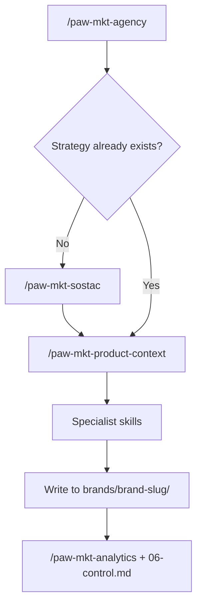

# Agentic Marketing Docs

Use this docs set to understand how the suite works, where to start, what each skill produces, and how outputs move through the brand workspace.

## Start here

- [Getting started](getting-started.md)
- [New brand onboarding](workflows/new-brand-onboarding.md)
- [SOSTAC planning](workflows/sostac-planning.md)
- [Implementation after SOSTAC](workflows/implementation-after-sostac.md)
- [Quick task without a full plan](workflows/quick-task-without-full-plan.md)

## Core concepts

- [Brand workspace](reference/brand-workspace.md)
- [Common patterns](reference/common-patterns.md)
- [Skill workflow roadmap](reference/skill-workflow-roadmap.md)
- [Deliverables and file locations](reference/deliverables-and-file-locations.md)
- [Glossary](reference/glossary.md)

## Skill reference

### Coordinator and planning
- [paw-mkt-agency](skills/paw-mkt-agency.md)
- [paw-mkt-sostac](skills/paw-mkt-sostac.md)
- [paw-mkt-product-context](skills/paw-mkt-product-context.md)

### Channel execution
- [paw-mkt-content](skills/paw-mkt-content.md)
- [paw-mkt-email](skills/paw-mkt-email.md)
- [paw-mkt-seo](skills/paw-mkt-seo.md)
- [paw-mkt-social](skills/paw-mkt-social.md)
- [paw-mkt-video](skills/paw-mkt-video.md)
- [paw-mkt-paid-ads](skills/paw-mkt-paid-ads.md)
- [paw-mkt-pr](skills/paw-mkt-pr.md)
- [paw-mkt-influencer](skills/paw-mkt-influencer.md)
- [paw-mkt-referral](skills/paw-mkt-referral.md)
- [paw-mkt-community](skills/paw-mkt-community.md)
- [paw-mkt-guerrilla](skills/paw-mkt-guerrilla.md)

### Conversion and revenue
- [paw-mkt-cro](skills/paw-mkt-cro.md)
- [paw-mkt-retention](skills/paw-mkt-retention.md)
- [paw-mkt-pricing](skills/paw-mkt-pricing.md)
- [paw-mkt-launch](skills/paw-mkt-launch.md)
- [paw-mkt-sales](skills/paw-mkt-sales.md)
- [paw-mkt-psychology](skills/paw-mkt-psychology.md)

### Measurement
- [paw-mkt-analytics](skills/paw-mkt-analytics.md)

## How the suite usually flows

## Recommended ways to use the suite

### 1. Full strategic build
Start with `/paw-mkt-agency` or `/paw-mkt-sostac` when you want a durable, cross-channel plan.

### 2. Execution from an existing plan
If a brand already has SOSTAC files, create or refresh `product-marketing-context.md` and then run the specialist skills tied to the tactics.

### 3. One-off deliverable
If you only need one asset right now, start with a specialist directly. The suite may still suggest strategy if context is thin.

## Design principle

Most skills are not just prompt generators. They are file-producing workflows. The outputs are meant to accumulate inside `brands/{brand-slug}/` so future sessions can resume from real artifacts instead of memory.

Skills use **progressive disclosure** — each SKILL.md stays lean while hundreds of framework files are available on demand. A lightweight `frameworks-index.csv` in each skill lets Claude match your situation to the right framework file without loading everything into context.
