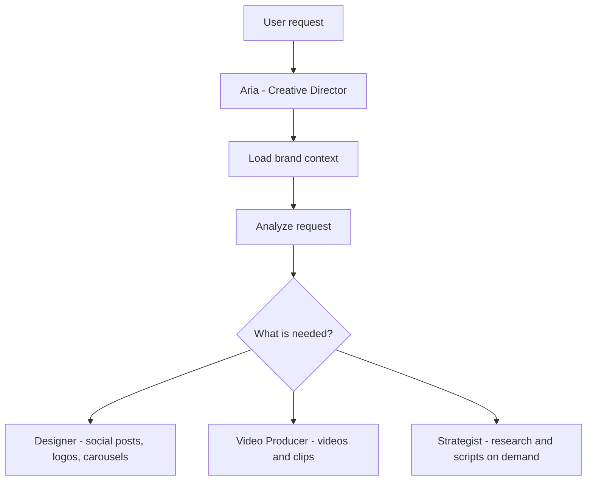

# Creative Suite (paw-cra-*)

The Creative Suite provides 15 skills for AI-powered visual and video production. It's designed around a team of agent specialists who work together to produce campaign-ready assets.

## Quick Navigation

| I want to... | Go to |
|--------------|-------|
| Get started with creative | [User Guide: Introduction](./user-guide/part-1-introduction.md) |
| Create my first asset | [User Guide: Quickstart](./user-guide/part-2-quickstart.md) |
| Design social posts or carousels | [Design Workflows](./user-guide/part-4-design-workflows.md) |
| Produce videos | [Video Workflows](./user-guide/part-5-video-workflows.md) |
| Run a multi-asset campaign | [Campaign Orchestration](./user-guide/part-6-orchestration.md) |

## The Creative Team

### Agents (Specialists with Memory)

| Agent | Role | When to Call |
|-------|------|--------------|
| [Aria (Creative Director)](./skills/paw-cra-agent-creative-director.md) | Orchestrates all creative work, routes to specialists | First point of contact, campaign planning |
| [Designer](./skills/paw-cra-agent-designer.md) | Visual production: social posts, carousels, logos, flyers | Any visual asset |
| [Video Producer](./skills/paw-cra-agent-video-producer.md) | Video production: Reels, TikToks, YouTube, clips | Any video content |
| [Strategist](./skills/paw-cra-agent-strategist.md) | Research, scripts, copy (on-demand service agent) | Competitor research, scripts, copy |

### Workflows (Deterministic Pipelines)

| Workflow | Purpose | Output |
|----------|---------|--------|
| [Campaign Orchestration](./skills/paw-cra-campaign-orchestration.md) | Multi-deliverable campaigns | Complete campaign folder |
| [Design: Social](./skills/paw-cra-design-social.md) | Social posts and carousels | PNG/JPG files |
| [Design: Brand](./skills/paw-cra-design-brand.md) | Logos, icons, flyers, banners | PNG/SVG/PDF files |
| [Design: Batch](./skills/paw-cra-design-batch.md) | Bulk asset production | Multiple assets, manifest |
| [Video: Shortform](./skills/paw-cra-video-shortform.md) | TikTok/Reels/Shorts (15-90s) | MP4 with subtitles |
| [Video: Longform](./skills/paw-cra-video-longform.md) | YouTube/web video (1-10 min) | MP4 with subtitles |
| [Video: Clips](./skills/paw-cra-video-clips.md) | Extract clips from long video | Multiple MP4 clips |
| [Multi-Platform Export](./skills/paw-cra-multi-platform-export.md) | Resize for all platforms | Platform-variant exports |
| [Quality Control](./skills/paw-cra-quality-control.md) | Campaign-level QC | QA report |
| [Content Research](./skills/paw-cra-content-research.md) | On-demand research | Research bundle |

### Setup

| Skill | Purpose |
|-------|---------|
| [Creative Setup](./skills/paw-cra-setup.md) | Install and configure Creative Suite |

## How the Suite Flows

## Production-First Routing

When you request a specific deliverable (e.g., "create a logo"), Aria routes directly to the appropriate specialist. The Strategist is invoked on-demand for research needs, not as a mandatory gate.

## Starting Paths

**Path 1: First creative asset**
1. Invoke Aria: `/paw-cra-agent-creative-director`
2. Describe what you need: "I need a social post for Instagram"
3. Aria routes to Designer
4. Receive your asset

**Path 2: Multi-asset campaign**
1. Invoke Aria: `/paw-cra-agent-creative-director`
2. Describe campaign: "I need a launch campaign for [product]"
3. Aria creates a plan with recommended assets
4. Approve the plan
5. Aria orchestrates production across Designer and Video Producer

**Path 3: Direct production**
1. Go straight to Designer: `/paw-cra-agent-designer`
2. Or Video Producer: `/paw-cra-agent-video-producer`
3. Describe your asset
4. Receive deliverable

## Design Principle

The Creative Suite produces production-ready files, not just concepts. Every asset is:
- Platform-correct dimensions
- Brand-validated
- Ready to upload/publish
- Accompanied by a manifest file for tracking

## User Guide

| Part | Topic |
|------|-------|
| [Part 1](./user-guide/part-1-introduction.md) | Introduction — Meet the Creative Team |
| [Part 2](./user-guide/part-2-quickstart.md) | Quickstart — Your First Asset in 10 Minutes |
| [Part 3](./user-guide/part-3-agents.md) | Agents — Deep Dive into Each Specialist |
| [Part 4](./user-guide/part-4-design-workflows.md) | Design Workflows — Step-by-Step Visual Production |
| [Part 5](./user-guide/part-5-video-workflows.md) | Video Workflows — Step-by-Step Video Production |
| [Part 6](./user-guide/part-6-orchestration.md) | Orchestration — Multi-Asset Campaigns |
| [Part 7](./user-guide/part-7-appendices.md) | Appendices — Troubleshooting & Reference |