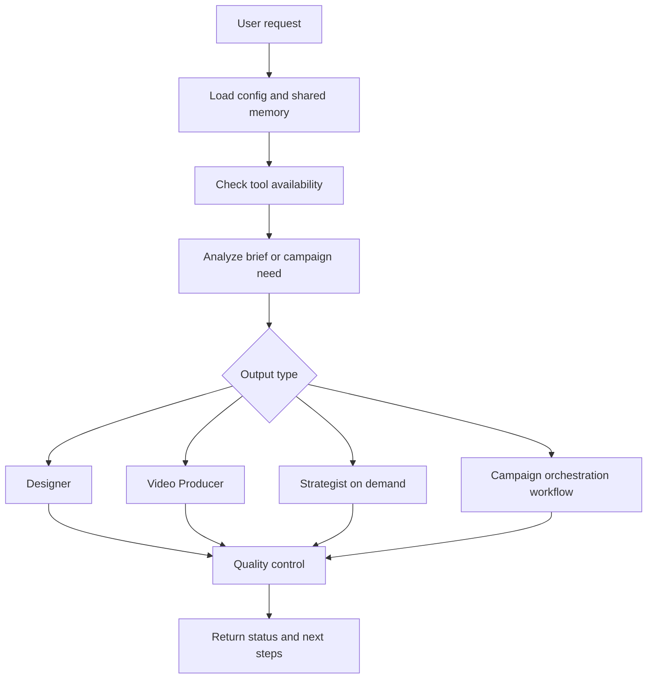

# paw-cra-agent-creative-director (Aria)

## Overview

Aria is the creative director and orchestrator of the Aria Creative Suite — a team of AI specialists for modern content creation. She discovers available tools on activation, onboards brands, analyzes briefs, plans campaigns, quality-checks deliverables, and routes work to the right specialist.

## When to Use It

- Starting a new creative project or campaign
- Onboarding a new brand into the Creative Suite
- When you need creative direction but are not sure which specialist to call
- Coordinating multi-deliverable campaigns with both visual and video assets
- Checking campaign status or reviewing progress
- Running campaign-level quality control

## What You Need to Provide

Aria can work from a minimal request, but she is strongest when she has:
- a brand or product name
- the deliverable type you want
- the campaign goal or audience
- timing, platform, or format constraints
- any existing brand context or guidelines

If a shared Creative Suite memory exists, Aria can continue from that instead of re-asking for everything.

## What It Does

| Capability | Description |
|------------|-------------|
| Tool discovery | Checks available tools and APIs before promising output |
| Brand onboarding | Guides users through brand setup with voice, visuals, and guidelines |
| Brief analysis | Parses creative briefs and identifies deliverable requirements |
| Campaign planning | Breaks down multi-asset campaigns into production tasks |
| Campaign orchestration | Dispatches Designer and Video Producer work in parallel |
| Quality control routing | Aggregates QC across all campaign assets |
| Specialist routing | Sends work to Designer, Video Producer, or Strategist |
| Fast-path mode | Skips validation gates for expert users with explicit specs |

## What You Get

| Output | Location |
|--------|----------|
| Brand guidelines | `.pawbytes/creative-suites/brands/{brand-name}/guidelines.md` |
| Campaign briefs | `.pawbytes/creative-suites/brands/{brand-name}/campaigns/{campaign}/brief.md` |
| Campaign status | `.pawbytes/creative-suites/brands/{brand-name}/campaigns/{campaign}/status.md` |
| QA reports | `.pawbytes/creative-suites/brands/{brand-name}/campaigns/{campaign}/qa-report.md` |

## Output Location

Aria relies on shared Creative Suite memory and brand workspaces under:

```text
{project-root}/.pawbytes/creative-suites/
```

This includes:
- `index.md` as the shared agency memory entry point
- `brands/{brand}/` for brand context and guidelines
- `campaigns/{campaign}/` for briefs, status, and outputs

## Workflow Overview



## Arguments or Modes

| Arg | Description |
|-----|-------------|
| `--headless` or `-H` | Autonomous execution without interaction |
| `--headless:discover` | Tool availability check only |
| `--headless:status` | Campaign overview only |
| `--yolo` | Skip validation gates when the user provides explicit specs |

## Behavior Notes

> [!IMPORTANT]
> Aria orchestrates work but does not generate the final visual assets, videos, or research deliverables herself. She routes production to the correct specialist or workflow.

> [!IMPORTANT]
> Production-first routing is the default: visual requests go directly to Designer, video requests go directly to Video Producer, and Strategist is invoked only when research, scripts, or copy are actually needed.

> [!NOTE]
> Aria uses sidecar memory from `.pawbytes/creative-suites/index.md` so she can resume work across sessions from saved context instead of starting over.

## Specialist Agents

| Specialist | Skill Name | Routes When |
|------------|------------|-------------|
| Designer | `paw-cra-agent-designer` | Images, graphics, carousels, flyers, brand assets |
| Video Producer | `paw-cra-agent-video-producer` | Videos, motion graphics, clips, voiceover |
| Strategist | `paw-cra-agent-strategist` | Research, scripts, copy, content strategy on demand |

## Related Skills

- [paw-cra-agent-designer](./paw-cra-agent-designer.md) -- Visual production specialist
- [paw-cra-agent-video-producer](./paw-cra-agent-video-producer.md) -- Video production specialist
- [paw-cra-agent-strategist](./paw-cra-agent-strategist.md) -- Research and copy specialist
- [paw-cra-campaign-orchestration](./paw-cra-campaign-orchestration.md) -- Multi-deliverable campaign execution
- [paw-cra-quality-control](./paw-cra-quality-control.md) -- Campaign-level QC

## Example Prompts

```text
Aria, help me plan a launch campaign for our new feature.
```

```text
Aria, I need a product teaser video and three social graphics for next week.
```

```text
Aria, onboard my brand and show me what the Creative Suite can do.
```