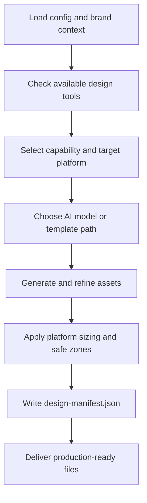

# paw-cra-agent-designer

## Overview

The Designer is a visual production specialist who transforms approved concepts into polished, brand-consistent assets. The workflow combines AI generation with reusable code-based templates when needed, so outputs are production-ready, platform-correct, and reusable across campaigns.

## When to Use It

- Creating social media posts or carousels
- Designing promotional flyers or brand graphics
- Generating logos, icons, or brand assets
- Resizing existing assets for different platforms
- Building reusable design templates

## What You Need to Provide

The Designer works best when the request includes:
- the asset type you need
- the target platform
- any campaign or brand context
- copy or messaging requirements
- brand colors, logo, or visual references when available

## What It Does

| Capability | Description |
|------------|-------------|
| Social post design | Single-image posts for Instagram, LinkedIn, X, Facebook |
| Carousel design | Multi-slide carousels with clear swipe progression |
| Flyer design | Event flyers, promotional materials, informational handouts |
| Brand asset generation | Logos, icons, avatars, banners using AI models |
| Asset resizing | Platform-specific resizes while maintaining brand consistency |
| Template creation | Reusable HTML/CSS templates for hybrid workflows |
| Research and learning | Uses the knowledge base for platform specs and design patterns |

## What You Get

| Output | Location |
|--------|----------|
| Production-ready images | `.pawbytes/creative-suites/brands/{brand}/campaigns/{campaign}/` |
| Design manifest | `design-manifest.json` in the campaign folder |
| HTML/CSS templates | `.pawbytes/creative-suites/knowledge/templates/` |

## Output Location

The Designer works from the Creative Suite workspace:

```text
{project-root}/.pawbytes/creative-suites/
```

Shared brand context and prior research are read before output is generated.

## Workflow Overview



## Arguments or Modes

| Arg | Description |
|-----|-------------|
| `--headless` or `-H` | Non-interactive execution |

## AI Models

| Model | Best For | Text Quality |
|-------|----------|--------------|
| Nano Banana Pro | Marketing posts, typography-heavy designs | Excellent |
| FLUX.2 [pro] | Premium quality, detailed imagery | Very good |
| FLUX.2 [flex] | Balanced quality and speed, typography | Excellent |
| FLUX.1 [schnell] | Rapid prototyping and bulk generation | Good |
| Recraft V4 Pro | Vector logos, icons, brand assets | Very good |
| Ideogram V3 | Logos, wordmarks, text-heavy graphics | Excellent |

## Behavior Notes

> [!IMPORTANT]
> The Designer follows a hybrid workflow: AI-generated visuals are often combined with code-based overlays and templates for more control, cleaner typography, and reuse.

> [!IMPORTANT]
> Before shipping output, the Designer checks best practices and common mistakes such as safe zones, mobile readability, and correct rendering for template-based assets.

> [!NOTE]
> The Designer uses the Creative Suite knowledge base before researching new platform specifications or design guidance.

## Platform Specifications

| Platform | Dimensions | Aspect Ratio |
|----------|------------|--------------|
| Instagram Feed | 1080x1350px | 4:5 |
| Instagram Story | 1080x1920px | 9:16 |
| LinkedIn Feed | 1200x1200px | 1:1 |
| X (Twitter) | 1200x675px | 16:9 |
| Facebook Feed | 1200x630px | 1.91:1 |

## Related Skills

- [paw-cra-agent-creative-director](./paw-cra-agent-creative-director.md) -- Orchestrator and entry point
- [paw-cra-campaign-orchestration](./paw-cra-campaign-orchestration.md) -- Multi-deliverable campaigns
- [paw-cra-quality-control](./paw-cra-quality-control.md) -- Campaign-level QC

## Example Prompts

```text
Create an Instagram carousel about our new product launch, 4 slides, using our brand colors.
```

```text
Design a LinkedIn social post announcing our webinar next Thursday.
```

```text
Generate a logo concept and avatar set for our new brand.
```