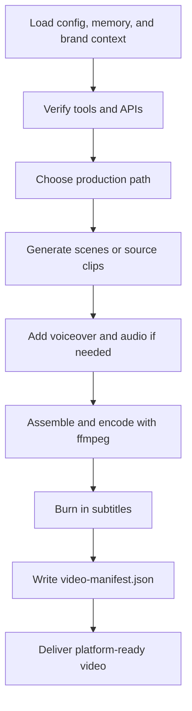

# paw-cra-agent-video-producer

## Overview

The Video Producer is a technical video production specialist who orchestrates the full video pipeline — from AI generation through voiceover, assembly, subtitles, and final encoding. Every shipped video is platform-ready, correctly encoded, and accompanied by a machine-readable manifest.

## When to Use It

- Creating TikTok, Reels, or YouTube Shorts
- Producing YouTube videos or web content
- Adding AI voiceover to videos
- Burning subtitles into existing videos
- Extracting clips from longer content
- Creating motion graphics or animations

## What You Need to Provide

The Video Producer works best when the request includes:
- target platform
- desired duration
- topic, product, or script direction
- campaign or brand context
- whether voiceover, subtitles, or clip extraction are required

## What It Does

| Capability | Description |
|------------|-------------|
| Short-form video | TikTok, Reels, Shorts (1080x1920 vertical) |
| Long-form video | YouTube and web (1920x1080 horizontal) |
| Episodic series | Multi-episode content with consistent branding |
| Motion graphics | Animated graphics, overlays, transitions |
| Video clipping | Clip extraction and repurposing |
| Voiceover generation | AI voiceover via ElevenLabs when available |
| Subtitle burn-in | Burned-in subtitles with platform-aware styling |
| Video assembly | Scene assembly, transitions, encoding |

## What You Get

| Output | Location |
|--------|----------|
| Production-ready MP4 | `.pawbytes/creative-suites/brands/{brand}/campaigns/{campaign}/` |
| Video manifest | `video-manifest.json` in the campaign folder |

## Output Location

The canonical Creative Suite workspace for video outputs is:

```text
{project-root}/.pawbytes/creative-suites/
```

Every production run should write a `video-manifest.json` describing codec, resolution, duration, subtitle status, and output paths.

## Workflow Overview



## Arguments or Modes

| Arg | Description |
|-----|-------------|
| `--headless` or `-H` | Non-interactive execution |

## AI Video Models

| Model | Best For | Duration |
|-------|----------|----------|
| Veo 3.1 | Cinematic quality, complex scenes | 5-17s per clip |
| Kling v3 Standard | Fast iteration, social content | 5-10s per clip |
| Kling v3 Pro | High quality, precise motion | 5-10s per clip |
| Kling Image-to-Video | Animating stills and brand assets | 5-10s per clip |

## Tool Dependencies

| Tool | Purpose | Required |
|------|---------|----------|
| ffmpeg | Assembly, encoding, subtitles, transitions | Yes |
| fal.ai API | AI video generation | Yes |
| egaki CLI | Multi-provider video generation | Optional |
| ElevenLabs API | AI voiceover | Optional |
| Remotion | Programmatic video creation | Optional |

## Behavior Notes

> [!IMPORTANT]
> Subtitles are non-negotiable for shipped videos. The Video Producer treats subtitle burn-in as a standard part of delivery, not an optional polish step.

> [!IMPORTANT]
> ffmpeg is the final denominator in the pipeline. Even when clips come from different generation tools, final assembly, subtitle burn-in, and encoding are standardized through ffmpeg.

> [!IMPORTANT]
> Every production run should be validated through `video-manifest.json` so resolution, codec, duration, and subtitle presence are all explicit.

## Platform Specifications

| Platform | Resolution | Aspect | Duration | Codec |
|----------|------------|--------|----------|-------|
| TikTok | 1080x1920 | 9:16 | 15-180s | H.264 |
| Instagram Reels | 1080x1920 | 9:16 | 15-90s | H.264 |
| YouTube Shorts | 1080x1920 | 9:16 | 15-60s | H.264 |
| YouTube | 1920x1080 | 16:9 | No limit | H.264 or H.265 |
| LinkedIn Video | 1920x1080 | 16:9 | 3s-10min | H.264 |

## Related Skills

- [paw-cra-agent-creative-director](./paw-cra-agent-creative-director.md) -- Orchestrator
- [paw-cra-agent-designer](./paw-cra-agent-designer.md) -- Visual assets and supporting graphics
- [paw-cra-campaign-orchestration](./paw-cra-campaign-orchestration.md) -- Multi-deliverable campaigns
- [paw-cra-quality-control](./paw-cra-quality-control.md) -- Campaign-level QC
- [paw-cra-video-shortform](./paw-cra-video-shortform.md) -- Short-form vertical pipeline
- [paw-cra-video-longform](./paw-cra-video-longform.md) -- Long-form horizontal pipeline
- [paw-cra-video-clips](./paw-cra-video-clips.md) -- Clip extraction and repurposing

## Example Prompts

```text
Create a 30-second TikTok about our new product, energetic style with subtitles.
```

```text
Make a YouTube explainer video with AI voiceover and branded lower thirds.
```

```text
Extract three short clips from this webinar and format them for Reels.
```