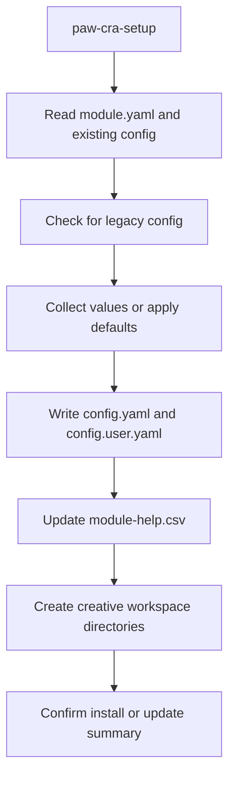

# paw-cra-setup

## Overview

Installs and configures the Pawbytes Creative Suites module in a project. It writes shared and user config, registers module capabilities with the help system, and prepares the `.pawbytes/creative-suites/` workspace for brand, knowledge, and daily activity files.

## When to Use It

- First-time setup of Creative Suites in a project
- Updating existing Creative Suites configuration
- Adding API keys after initial setup
- Migrating from a legacy config format into the Pawbytes ecosystem structure

## What You Need to Provide

The setup flow can gather values interactively, but it is designed to collect everything in one pass.

Typical values include:
- user name
- communication language
- document output language
- `fal_key`
- optional `elevenlabs_api_key`
- optional `pexels_api_key`
- output directory

## What It Does

| Step | Purpose |
|------|---------|
| Module load | Reads module metadata from `./assets/module.yaml` |
| Config check | Checks for existing config and legacy formats |
| Collect values | Gathers user preferences and API keys |
| Write config | Writes to `config.yaml` and `config.user.yaml` |
| Create directories | Creates output folders for brands, knowledge, and daily logs |
| Register help | Adds capabilities to `module-help.csv` |

## What You Get

| Output | Location |
|--------|----------|
| Shared config | `{project-root}/.pawbytes/config/config.yaml` |
| User settings | `{project-root}/.pawbytes/config/config.user.yaml` |
| Help registry | `{project-root}/.pawbytes/config/module-help.csv` |
| Creative workspace | `{project-root}/.pawbytes/creative-suites/` |

## Output Location

The canonical Creative Suite workspace is:

```text
{project-root}/.pawbytes/creative-suites/
```

Important path rules:
- `{project-root}` is stored as a literal token in config values
- user-only values and API keys stay in `config.user.yaml`
- shared module settings stay in `config.yaml`

## Workflow Overview



## Arguments or Modes

| Arg | Description |
|-----|-------------|
| `accept all defaults` | Skip prompting and use default values |
| `--headless` | Non-interactive setup with defaults |
| Inline values | Example: `user name is Alex, fal key is abc123` |

## Behavior Notes

> [!IMPORTANT]
> `{project-root}` is a literal token in stored config values. It should not be replaced with a real path inside the config files.

> [!IMPORTANT]
> The setup flow uses an anti-zombie pattern: existing entries for this module are removed before fresh values are written, so stale config does not linger.

> [!NOTE]
> Legacy config under `_bmad/config.yaml` can be migrated into the current Pawbytes config structure.

## File Structure After Setup

```text
{project-root}/
  .pawbytes/
    config/
      config.yaml           # Shared config (committed)
      config.user.yaml      # User settings (gitignored)
      module-help.csv       # Capability registry
    creative-suites/
      index.md              # Agency memory index
      brands/               # Brand guidelines and assets
      knowledge/            # Research and references
      daily/                # Activity logs
```

## Related Skills

- [paw-cra-agent-creative-director](./paw-cra-agent-creative-director.md) -- Start here after setup
- All other Creative Suite skills require this setup to be completed first

## Example Prompts

```text
Setup creative suites, my name is Alex, fal key is abc123.
```

```text
/paw-cra-setup --headless
Use defaults, store my fal key, and create the standard Creative Suite workspace.
```

```text
Configure creative suites and migrate any legacy config into the new Pawbytes structure.
```