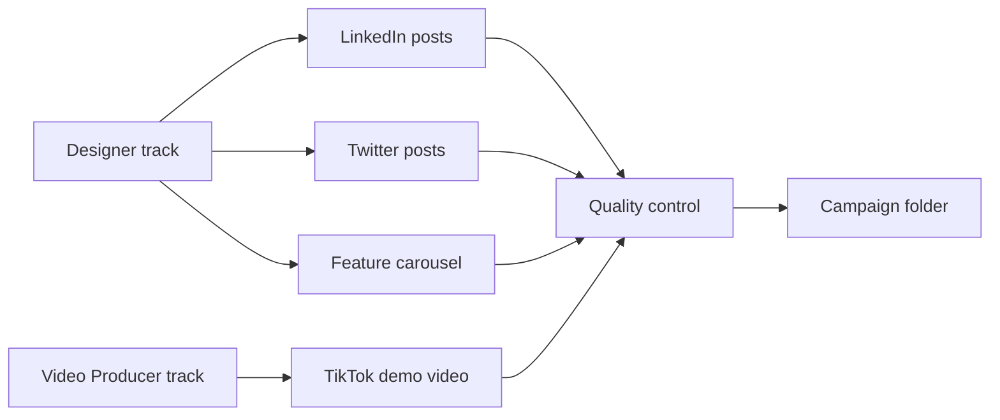

# Part 6: Campaign Orchestration

This guide explains how to run multi-asset campaigns and export your work to multiple platforms. These workflows save hours of manual work by coordinating production automatically.

---

## Table of Contents

1. [Multi-Asset Campaign Workflow](#multi-asset-campaign-workflow)
2. [Multi-Platform Export Workflow](#multi-platform-export-workflow)

---

## Multi-Asset Campaign Workflow

### What Is Campaign Orchestration?

Campaign orchestration is Aria's ability to manage multiple deliverables at once. Instead of requesting each asset individually, you describe your campaign once, and Aria coordinates the entire production behind the scenes.

**What happens automatically:**

| Step | What Aria Does |
|------|----------------|
| 1 | Parses your campaign brief to identify all deliverables |
| 2 | Analyzes dependencies (which assets need to be created first) |
| 3 | Dispatches Designer and Video Producer to work in parallel |
| 4 | Tracks progress across all production tracks |
| 5 | Runs quality control on all produced assets |
| 6 | Delivers everything organized in a campaign folder |

### When to Use This Workflow

Use campaign orchestration when you need:

- Multiple assets for a product launch
- A coordinated social media campaign
- Content for multiple platforms at once
- Any project with more than 3 deliverables

**Time savings:** A typical 7-asset campaign takes approximately 45 minutes with orchestration, compared to 4-6 hours manually.

---

### Step-by-Step: Running a Multi-Asset Campaign

#### Step 1: Describe Your Campaign

Tell Aria what you need in plain language.

**What to include:**

| Element | Example |
|---------|---------|
| What you're promoting | "a new SaaS feature for marketers" |
| Timeline | "launching next Monday" |
| Platforms | "LinkedIn and Twitter" |
| Asset types | "social posts, a demo video, and a carousel" |

**Example prompt:**

```
I'm launching a new AI writing assistant for marketers next week.
I need LinkedIn posts, Twitter posts, and a TikTok demo video.
```

#### Step 2: Review Aria's Plan

Aria responds with a recommended campaign plan.

**What the plan includes:**

| Day | Asset | Platform | Purpose |
|-----|-------|----------|---------|
| Thu (pre-launch) | Teaser post | LinkedIn | Build anticipation |
| Thu (pre-launch) | Teaser post | Twitter | Build anticipation |
| Mon (launch) | Announcement post | LinkedIn | Main launch |
| Mon (launch) | Demo video (30s) | Twitter | Show it in action |
| Mon (launch) | Feature carousel | LinkedIn | Detailed walkthrough |
| Wed (post-launch) | Case study post | LinkedIn | Proof points |

#### Step 3: Approve or Modify

| To do this... | Say this... |
|---------------|-------------|
| Approve the plan | "Looks good, proceed" or "Yes, start production" |
| Add an asset | "Add a TikTok video too" |
| Remove an asset | "Remove the flyer" |
| Change timing | "Move the teaser to Friday instead" |

#### Step 4: Production Runs in Parallel

Once approved, Aria dispatches work to the specialist agents:



**What happens during production:**

1. Designer creates all visual assets
2. Video Producer creates all video assets
3. Both tracks work simultaneously (saves time)
4. All assets follow consistent branding
5. Progress is tracked in a status file

#### Step 5: Quality Check

Aria runs quality control on all produced assets:

| Check | What's Verified |
|-------|-----------------|
| Brand consistency | Colors, fonts, logo usage match guidelines |
| Format validation | Correct dimensions and file types for each platform |
| Visual consistency | All assets feel like they belong to the same campaign |
| Technical specs | File sizes within platform limits |

#### Step 6: Receive Your Campaign

All assets are delivered in an organized folder structure.

---

### Campaign Folder Structure

```text
.pawbytes/creative-suites/brands/your-brand/campaigns/ai-writing-assistant-launch/
+-- status.md                    # Campaign progress tracker
+-- brief.md                     # Your original campaign brief
+-- assets/
|   +-- social/
|   |   +-- linkedin-teaser.png
|   |   +-- linkedin-announcement.png
|   |   +-- linkedin-carousel/
|   |   |   +-- slide-01.png
|   |   |   +-- slide-02.png
|   |   |   +-- slide-03.png
|   |   |   +-- slide-04.png
|   |   |   +-- slide-05.png
|   |   +-- twitter-teaser.png
|   |   +-- twitter-demo.mp4
+-- video/
|   +-- tiktok-demo.mp4
|   +-- subtitles.srt
+-- qa-report.md                 # Quality check results
+-- campaign-manifest.json       # Machine-readable asset list
```

---

### End-to-End Example: Product Launch Campaign

**Scenario:** Sarah is a product manager at a tech company. She's launching an AI writing assistant feature next Monday and needs a coordinated campaign.

**Step 1: Sarah's Request**

```
Sarah: "Aria, I'm launching a new AI writing assistant for marketers next week.
I need LinkedIn posts, Twitter posts, and a TikTok demo video."
```

**Step 2: Aria's Response**

```
Aria: I'll help you create a launch campaign! Let me ask a few questions:

1. What's the main benefit users will love?
2. Who's the target audience?
3. Any specific messaging you want to include?
```

**Step 3: Sarah Provides Details**

```
Sarah: "It helps marketers write content 3x faster. Target is marketing teams
at B2B companies. Key message: 'Write better content in half the time.'"
```

**Step 4: Aria Creates the Plan**

```
Aria: Here's my recommended campaign plan:

| Day | Asset | Platform |
|-----|-------|----------|
| Thu | Teaser: "Something's coming..." | LinkedIn, Twitter |
| Mon | Launch announcement | LinkedIn |
| Mon | 30-second demo video | Twitter, TikTok |
| Mon | Feature carousel (5 slides) | LinkedIn |
| Wed | Customer quote graphic | LinkedIn |

Should I proceed with this plan?
```

**Step 5: Sarah Approves**

```
Sarah: "Yes, but make the demo video for TikTok vertical instead of square."
```

**Step 6: Production**

```
Aria: Great! I'm dispatching the Designer and Video Producer now.
They'll work in parallel to create your assets.

[Progress updates appear as assets are created]

Designer: Created LinkedIn teaser
Designer: Created Twitter teaser
Video Producer: Created TikTok demo video (vertical 9:16)
Designer: Created LinkedIn announcement
Designer: Created 5-slide carousel
Designer: Created customer quote graphic

Running quality control...
All assets passed QC!
```

**Step 7: Delivery**

```
Aria: Your campaign is ready! All 7 assets are in your campaign folder:

.pawbytes/creative-suites/brands/techcompany/campaigns/ai-writing-assistant-launch/

Total production time: 42 minutes
Assets created: 7
Platforms covered: 3
```

---

### Campaign Status Tracking

Aria maintains a status file that tracks progress. If anything interrupts the campaign, Aria can resume from where it left off.

**Status file example:**

```yaml
campaign: ai-writing-assistant-launch
brand: techcompany
status: complete
created: 2026-04-01T09:00:00Z
updated: 2026-04-01T09:42:00Z
deliverables_total: 7
deliverables_complete: 7
design_track: complete
video_track: complete
qc_status: passed
```

---

## Multi-Platform Export Workflow

### What Is Multi-Platform Export?

Multi-platform export takes one "hero" asset and creates correctly-sized versions for every platform you need. It handles resizing, safe zone enforcement, and file organization automatically.

**Why this matters:**

| Platform | Feed Dimensions | Story Dimensions |
|----------|-----------------|------------------|
| Instagram | 1080 x 1080 (square) or 1080 x 1350 (portrait) | 1080 x 1920 |
| TikTok | 1080 x 1920 | N/A |
| YouTube Thumbnail | 1280 x 720 | N/A |
| LinkedIn | 1200 x 627 | 1080 x 1920 |
| Twitter/X | 1600 x 900 | N/A |
| Facebook | 1200 x 630 | 1080 x 1920 |
| Pinterest | 1000 x 1500 | N/A |

Creating each variant manually takes approximately 10 minutes per platform. Multi-platform export does it in seconds.

---

### Step-by-Step: Exporting to Multiple Platforms

#### Step 1: Identify Your Hero Asset

A "hero" asset is your main visual that you want to adapt for different platforms.

**Say:**

```
Export this image for all platforms: [filename or describe the asset]
```

**Or specify platforms:**

```
Export hero-image.png for Instagram, TikTok, and LinkedIn
```

#### Step 2: Select Target Platforms

Choose from the supported platforms:

| Platform | Available Formats |
|----------|-------------------|
| Instagram | Feed (square, portrait), Story, Reel |
| TikTok | Feed video |
| YouTube | Thumbnail, Short |
| LinkedIn | Feed post |
| Twitter/X | Feed post |
| Facebook | Feed, Story |
| Pinterest | Pin |
| Google Business | Post |

#### Step 3: Safe Zone Enforcement

The system automatically protects important content from being hidden by platform UI overlays.

**What are safe zones?**

Safe zones are areas where platform interfaces (buttons, captions, navigation) may cover your content. The export workflow ensures critical elements stay visible.

| Platform | Top Safe Zone | Bottom Safe Zone | Left/Right |
|----------|---------------|------------------|------------|
| Instagram Story | 120px | 200px | 60px each side |
| TikTok | 50px | 150px | 20px each side |
| YouTube | 0 | 40px | 0 |
| Facebook Feed | 0 | 60px | 0 |
| LinkedIn | 0 | 50px | 0 |

**What gets protected:**

- Text overlays
- Logos
- Faces and key subjects
- Important visual elements

#### Step 4: Export and Delivery

All variants are generated and organized into platform-specific folders.

---

### Export Folder Structure

```
brands/your-brand/exports/campaign-name/
+-- instagram/
|   +-- brand_campaign_instagram_image_feed-square.jpg
|   +-- brand_campaign_instagram_image_feed-portrait.jpg
|   +-- brand_campaign_instagram_image_story.jpg
+-- tiktok/
|   +-- brand_campaign_tiktok_video_feed.mp4
+-- youtube/
|   +-- brand_campaign_youtube_image_thumbnail.jpg
+-- linkedin/
|   +-- brand_campaign_linkedin_image_feed.jpg
+-- twitter/
|   +-- brand_campaign_twitter_image_feed.jpg
+-- export-manifest.json      # Details of all exported files
```

---

### Naming Convention

Exported files follow a consistent naming pattern:

```
{brand}_{campaign}_{platform}_{type}_{variant}.{ext}
```

**Example:**

```
acme-corp_spring-launch_instagram_image_feed-portrait.jpg
```

| Part | Meaning |
|------|---------|
| `acme-corp` | Brand name |
| `spring-launch` | Campaign name |
| `instagram` | Target platform |
| `image` | Asset type |
| `feed-portrait` | Format variant |
| `jpg` | File format |

---

### End-to-End Example: Multi-Platform Export

**Scenario:** You created a hero image for a product launch and need it sized for all your social platforms.

**Step 1: Request**

```
User: "Export product-launch-hero.png for Instagram, TikTok, LinkedIn, and Twitter"
```

**Step 2: System Analyzes the Image**

```
System: Analyzing source image...
- Dimensions: 2400 x 3000 pixels
- Aspect ratio: 4:5 (portrait)
- File size: 4.2 MB
```

**Step 3: Determine Resize Strategy**

For each platform, the system chooses the best approach:

| Platform | Target Size | Strategy |
|----------|-------------|----------|
| Instagram Feed | 1080 x 1350 | Scale down (same ratio) |
| Instagram Story | 1080 x 1920 | Extend with brand color bars |
| TikTok | 1080 x 1920 | Smart crop + extend |
| LinkedIn | 1200 x 627 | Crop to center focal point |
| Twitter | 1600 x 900 | Crop to center focal point |

**Step 4: Safe Zone Check**

```
System: Verifying safe zones...
- Logo positioned 150px from top - safe on all platforms
- Product name centered - safe on all platforms
- No critical content in bottom 200px - safe for Stories/TikTok
```

**Step 5: Export**

```
System: Generating 6 variants...

[1/6] Instagram feed-portrait... done
[2/6] Instagram story... done
[3/6] TikTok feed... done
[4/6] LinkedIn feed... done
[5/6] Twitter feed... done
[6/7] Export manifest... done

Export complete! 6 files created in 4 seconds.
```

**Step 6: Delivery**

All files organized in the export folder:

```
brands/acme-corp/exports/product-launch/
+-- instagram/
|   +-- acme-corp_product-launch_instagram_image_feed-portrait.jpg
|   +-- acme-corp_product-launch_instagram_image_story.jpg
+-- tiktok/
|   +-- acme-corp_product-launch_tiktok_image_feed.jpg
+-- linkedin/
|   +-- acme-corp_product-launch_linkedin_image_feed.jpg
+-- twitter/
|   +-- acme-corp_product-launch_twitter_image_feed.jpg
+-- export-manifest.json
```

---

### Export Manifest

Every export includes a manifest file with complete details about each variant:

```json
{
  "brand": "acme-corp",
  "campaign": "product-launch",
  "exported_at": "2026-04-01T14:30:00Z",
  "source_assets": [
    {
      "path": "product-launch-hero.png",
      "dimensions": "2400x3000",
      "file_size_bytes": 4200000
    }
  ],
  "variants": [
    {
      "platform": "instagram",
      "variant": "feed-portrait",
      "filename": "acme-corp_product-launch_instagram_image_feed-portrait.jpg",
      "dimensions": "1080x1350",
      "aspect_ratio": "4:5",
      "file_size_bytes": 245000,
      "status": "ok"
    }
  ],
  "total_variants": 6,
  "total_size_bytes": 1500000
}
```

---

## Tips for Success

### Campaign Orchestration

| Tip | Why It Helps |
|-----|--------------|
| Provide a clear brief | Aria can plan better with more context |
| Include timeline | Helps prioritize and schedule assets |
| Approve plans quickly | Production starts after your approval |
| Request changes promptly | Faster feedback = faster delivery |

### Multi-Platform Export

| Tip | Why It Helps |
|-----|--------------|
| Create hero assets with margins | Gives flexibility for different aspect ratios |
| Keep important content centered | Safer for cropping to different sizes |
| Use high-resolution sources | Better quality when scaling down |
| Check safe zones for Stories | Bottom 200px often hidden by UI |

---

## Summary

| Workflow | Purpose | Time Saved |
|----------|---------|------------|
| Multi-Asset Campaign | Create multiple coordinated assets from one brief | 4-6 hours per campaign |
| Multi-Platform Export | Resize one asset for all platforms automatically | 10 minutes per platform |

Both workflows run automatically after your initial request, letting you focus on strategy while Aria handles production.