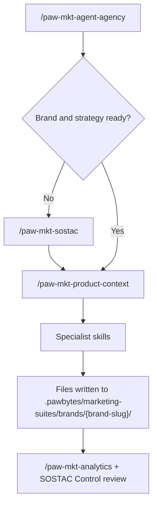

# Reference: Skill Workflow Roadmap

This page captures the current suite architecture and a recommended roadmap for making skill behavior more consistent.

It is written for maintainers of the Agentic Marketing Suite, not end users. The goal is to clarify:

- which skills are orchestrators, planners, context builders, or executors
- where deterministic workflow structure already exists
- which skills should gain stronger discovery or strategy gates
- how to sequence that work without collapsing the suite into one rigid flow

This is a **design and maintenance reference**. It describes the target operating model. It does **not** mean every recommendation is already implemented.

## Current suite operating model

The suite already implies a strong default path:

In practice, the suite already has four layers:

1. **Orchestrator** — `paw-mkt-agent-agency`
2. **Strategic planner** — `paw-mkt-sostac`
3. **Context bridge / strategic intelligence** — `paw-mkt-product-context`
4. **Specialist executors** — the remaining channel, conversion, revenue, and measurement skills

The biggest consistency gap is not architecture. It is **enforcement**.

The docs and skill files already imply a strategy-first system, but many executor skills still follow this softer pattern:

1. read context *when available*
2. ask what the user wants
3. generate output directly

That makes quick work possible, but it also means discovery, validation, and sequencing are uneven across the suite.

## Role taxonomy

| Tier | Skills | Primary job |
| --- | --- | --- |
| Orchestrator | `paw-mkt-agent-agency` | Select brand, assess context, route work, coordinate teams, track progress |
| Strategic planner | `paw-mkt-sostac` | Run research-first SOSTAC planning with explicit phase and review gates |
| Context bridge | `paw-mkt-product-context` | Extract and refine positioning, customer language, objections, proof, and differentiation |
| Infrastructure | `paw-mkt-setup` | Install and configure the suite |
| Measurement/control | `paw-mkt-analytics` | Operationalize KPIs, tracking, dashboards, attribution, and testing |
| Specialist executors | `paw-mkt-content`, `paw-mkt-email`, `paw-mkt-social`, `paw-mkt-video`, `paw-mkt-seo`, `paw-mkt-paid-ads`, `paw-mkt-pr`, `paw-mkt-influencer`, `paw-mkt-referral`, `paw-mkt-community`, `paw-mkt-guerrilla`, `paw-mkt-cro`, `paw-mkt-retention`, `paw-mkt-pricing`, `paw-mkt-launch`, `paw-mkt-sales`, `paw-mkt-psychology` | Turn strategy and context into channel-specific or function-specific deliverables |

## Standard workflow contract by skill type

The suite should not force every skill into the same shape. Different layers need different workflow contracts.

### 1. Orchestrator contract

Use for `paw-mkt-agent-agency`.

Default flow:

1. Load brand state
2. Check strategy/context readiness
3. Route to the correct path:
   - onboarding
   - planning
   - context building
   - specialist execution
   - progress review
4. Confirm handoff
5. Track progress and recommend next move

### 2. Strategic planner contract

Use for `paw-mkt-sostac`.

Default flow:

1. Research
2. Recommend
3. Validate
4. Save
5. Present review gate
6. Advance only after approval

This is already the strongest deterministic workflow in the suite and should be treated as the reference model for strategic work.

### 3. Context bridge contract

Use for `paw-mkt-product-context`.

Default flow:

1. Check existing files and freshness
2. Extract from SOSTAC and existing assets first
3. Interview only for missing gaps
4. Validate the draft against reality
5. Write the document
6. Mark freshness and recommend refresh timing

### 4. Executor contract

Use for most specialist skills.

Default flow:

1. **Preflight context check**
2. **Discovery or audit**
3. **Strategy or hypothesis definition**
4. **Build**
5. **QA or HITL review**
6. **Measurement and iteration**

This is the main missing pattern across the suite.

### 5. Quick-task bypass

Quick tasks should remain supported, but they should be an explicit bypass, not an accidental side effect of missing gates.

If the user wants a narrow deliverable now, the skill can skip the full executor contract **only when**:

- the request is narrow and low-risk
- brand context is already strong enough
- the user explicitly accepts the faster, less strategic path

## When strategy should be required

The suite currently documents both strategy-first execution and direct specialist invocation. To reduce ambiguity, use this rule set.

### Require strategy-first routing

Route to `paw-mkt-agent-agency`, `paw-mkt-sostac`, or `paw-mkt-product-context` first when any of these are true:

- the brand is new
- the task affects multiple channels
- the task changes pricing, packaging, or GTM motion
- the task is a launch or relaunch
- the work involves significant paid spend
- the audience, positioning, or offer is unclear
- the specialist would otherwise invent target segments or messaging from scratch

### Allow direct specialist execution

Allow a direct specialist path when all of these are true:

- the work is narrow
- the brand already has usable context
- the user needs one deliverable now
- the task can be safely done without re-planning the whole system

### Executor fallback rule

If `brand-context.md`, `paw-mkt-product-context.md`, or the relevant SOSTAC files are missing, executor skills should not silently jump to output.

They should do one of two things:

1. enter a **light discovery mode**, or
2. route back upstream to `paw-mkt-agent-agency`, `paw-mkt-sostac`, or `paw-mkt-product-context`

## Per-skill workflow matrix

Priority meanings:

- **P0** — foundation and control layer
- **P1** — highest-value workflow-hardening targets
- **P2** — important but more specialized or already partly structured
- **P3** — support or polish layer

### Foundation and control layer

| Skill | Current role | Recommended model | Suggested workflow shape | Priority |
| --- | --- | --- | --- | --- |
| `paw-mkt-agent-agency` | Orchestrator and router | Keep hybrid, harden strategy gates | `brand load -> strategy gate -> choose path -> handoff -> progress review` | P0 |
| `paw-mkt-sostac` | Strategic planner | Keep workflow, expand modern frameworks | `auto-discovery -> situation -> objectives -> strategy -> tactics -> action -> control -> final review` | P0 |
| `paw-mkt-product-context` | Context bridge | Keep hybrid, strengthen freshness and gap-fill flow | `check existing -> extract -> gap interview -> validate -> write -> refresh loop` | P0 |
| `paw-mkt-analytics` | Measurement specialist | Add explicit workflow wrapper | `baseline audit -> KPI map -> tracking/events -> dashboards/reporting -> experimentation/attribution -> review loop` | P1 |
| `paw-mkt-setup` | Infrastructure/bootstrap | Keep simple, improve handoff | `detect/migrate -> collect config -> validate tools/files -> handoff to agency` | P3 |

### Workflow-ready hybrids

These skills already show meaningful structure and should be hardened rather than rethought.

| Skill | Current role | Recommended model | Suggested workflow shape | Priority |
| --- | --- | --- | --- | --- |
| `paw-mkt-cro` | Execution specialist with strong gating | Keep hybrid | `preflight -> diagnostics -> audit journey -> prioritize fixes/tests -> QA -> measure` | P2 |
| `paw-mkt-seo` | Hybrid specialist with strong pSEO workflow | Keep hybrid, formalize non-pSEO flows | `context -> audit/keyword discovery -> prioritize by domain -> implementation plan -> monitor` | P2 |
| `paw-mkt-community` | Execution specialist with discovery gates | Keep hybrid | `purpose gate -> platform select -> 90-day launch -> engagement systems -> health review -> quarterly refresh` | P2 |
| `paw-mkt-launch` | Execution specialist with phase gates | Keep hybrid, strengthen discovery routing | `context -> tier/type classify -> research -> phase gates -> specialist handoffs -> post-launch learnings` | P2 |
| `paw-mkt-guerrilla` | Risk-gated specialist | Keep hybrid, add readiness diagnostics | `strategy check -> campaign state -> tactic/playbook select -> risk gate -> execute -> learn` | P2 |
| `paw-mkt-psychology` | Enablement specialist | Keep hybrid, add validation and test loop | `context -> behavior diagnosis -> principle select -> rewrite/hypothesis -> handoff -> test/measure` | P3 |

### Executor skills that should gain workflow wrappers

These are the biggest consistency opportunity across the suite.

| Skill | Current role | Recommended model | Suggested workflow shape | Priority |
| --- | --- | --- | --- | --- |
| `paw-mkt-content` | Execution specialist | Add workflow wrapper | `context -> audience/topic/SEO research -> pillars/calendar -> brief/draft -> distribution -> performance` | P1 |
| `paw-mkt-email` | Execution specialist | Add workflow wrapper | `context -> list/role audit -> segmentation -> sequence design -> copy/build -> deliverability/metrics` | P1 |
| `paw-mkt-social` | Execution specialist | Add workflow wrapper | `context -> audience/platform fit -> channel plan -> calendar/assets -> community ops -> metrics` | P1 |
| `paw-mkt-paid-ads` | Execution specialist | Add workflow wrapper | `offer/audience audit -> platform/budget strategy -> ad/competitor research -> creative/landing plan -> launch/test -> reporting` | P1 |
| `paw-mkt-pr` | Execution specialist | Add workflow wrapper | `PR readiness -> narrative/newsworthiness -> media research -> asset build -> outreach cadence -> coverage reporting` | P1 |
| `paw-mkt-retention` | Execution specialist | Add workflow wrapper | `churn diagnosis -> segment/root cause -> intervention design -> copy/build -> test -> health review` | P1 |
| `paw-mkt-influencer` | Execution specialist | Add workflow wrapper | `context -> creator discovery -> vet/scoring -> outreach/comp -> campaign ops -> reporting` | P2 |
| `paw-mkt-referral` | Execution specialist | Add workflow wrapper | `advocacy/readiness audit -> program type -> economics/incentive -> launch build -> loop optimization -> KPIs` | P2 |
| `paw-mkt-pricing` | Execution specialist | Add workflow wrapper | `strategy/segment validation -> market/WTP research -> value metric -> tier design -> pricing page/comms -> monitor` | P2 |
| `paw-mkt-sales` | Execution specialist | Add workflow wrapper | `enablement audit -> strategy alignment -> proof sourcing -> asset build -> rep review -> usage metrics` | P2 |
| `paw-mkt-video` | Execution specialist | Add workflow wrapper | `audience/objective -> platform priority -> format plan -> script/production brief -> publish/distribute -> performance` | P2 |

## Rollout order

### Wave 0 — foundation and control

Implement first:

- `paw-mkt-agent-agency`
- `paw-mkt-sostac`
- `paw-mkt-product-context`
- `paw-mkt-analytics`

Why:

- this establishes the canonical routing and gating behavior
- it gives the suite a single answer to “when is strategy required?”
- it closes the loop from planning to control

### Wave 1 — highest-volume execution skills

Implement next:

- `paw-mkt-content`
- `paw-mkt-email`
- `paw-mkt-social`
- `paw-mkt-paid-ads`
- `paw-mkt-pr`
- `paw-mkt-retention`

Why:

- these are high-frequency specialist entry points
- they show the clearest gap between “strategy-first” intention and current execution behavior
- hardening them will improve most day-to-day usage of the suite

### Wave 2 — specialized and already-partly-structured skills

Implement after that:

- `paw-mkt-pricing`
- `paw-mkt-sales`
- `paw-mkt-influencer`
- `paw-mkt-referral`
- `paw-mkt-video`
- `paw-mkt-launch`
- `paw-mkt-seo`
- `paw-mkt-cro`
- `paw-mkt-guerrilla`
- `paw-mkt-community`

Why:

- some are more specialized
- some already have meaningful structure
- some depend on stronger upstream gating to be most useful

### Wave 3 — support and polish

Implement last:

- `paw-mkt-psychology`
- `paw-mkt-setup`

Why:

- these are not the main operational bottleneck
- they benefit most after the primary routing and execution contracts are stable

## Design guardrails

As skills are updated, preserve these rules:

### 1. Do not flatten the suite into one giant workflow

The suite works because it separates:

- orchestration
- planning
- context building
- execution
- measurement

The goal is to add gates and sequencing where needed, not to erase specialization.

### 2. Keep quick-task mode, but make it explicit

Quick work is a feature. Silent skipping of discovery is not.

### 3. Prefer files over chat-only output

If a workflow gains new phases, those phases should generally write artifacts that later skills can read.

### 4. Put review gates at high-cost decisions

The more expensive the downstream work, the stronger the review gate should be.

Examples:

- strategic plan approvals
- launch type and tier selection
- pricing structure changes
- paid campaign launch readiness
- retention intervention logic

### 5. Make analytics the control layer, not a detached specialist

The suite already implies this. The implementation should make it explicit.

Specialists should produce measurement requirements that feed back into:

- `paw-mkt-analytics`
- SOSTAC Control review
- later strategy and tactic adjustments

## Implementation status (2026-04-01)

All 15 executor and planner skills now have formal `references/workflow.md` files. The CRO skill already had one and served as the template.

### Workflow files created

| Skill | Workflow Model | Phases | Key Innovation |
| --- | --- | --- | --- |
| `paw-mkt-sostac` | 6-phase x 5-step Research-Recommend-Validate matrix | 6 + HITL gates | Formalized existing deterministic flow with cross-phase dependency map |
| `paw-mkt-analytics` | Measurement Framework Pipeline | 6 | KPI hierarchy, metric definition cards, 5-tier reporting cadence |
| `paw-mkt-paid-ads` | PPC Campaign Lifecycle | 7 | Platform selection framework, 5-tier audience architecture, optimization cadence |
| `paw-mkt-retention` | Churn Diagnostic Framework | 5 | Mandatory diagnosis gate, health score model, save offer matrix |
| `paw-mkt-community` | Community Flywheel Lifecycle | 8 | Platform comparison matrix, founding member gate, community health score |
| `paw-mkt-pricing` | Pricing Strategy Pipeline | 5 | Problem classification gate, WTP research methods, rollback triggers |
| `paw-mkt-email` | Email Automation Pipeline | 7 | Sequence timing benchmarks, deliverability protocol, ESP recommendations |
| `paw-mkt-video` | Video Production Pipeline | 7 | Hook-first assessment, platform-format matrix, retention curve analysis |
| `paw-mkt-pr` | PR + Crisis Communication (dual-track) | 5+5 | Severity classification, time-bound crisis phases, holding statement template |
| `paw-mkt-guerrilla` | Growth Experiment Sprint | 7 | ICE-R scoring, mandatory risk gate, kill decision framework |
| `paw-mkt-content` | Content Marketing Lifecycle | 6 | 4 content type sub-workflows, A/B/C/D tier scoring, refresh schedule |
| `paw-mkt-influencer` | Influencer Campaign Lifecycle | 6 | Tier-based approaches (nano through mega), rate benchmarks, FTC compliance gate |
| `paw-mkt-referral` | Referral Program Lifecycle | 6 | K-factor benchmarks, program type branching, fraud prevention checklist |
| `paw-mkt-sales` | Sales Enablement Pipeline | 5 | Asset priority scoring, 8 new escalation routes (was 0), validation checklist |
| `paw-mkt-launch` | Launch Campaign Workflow (tier-based) | 6 (Phase 0-5) | Tier classification decision tree, ORB activation matrix, SOSTAC prerequisite |
| `paw-mkt-cro` | CRO Priority Framework | 9 | Pre-existing — served as template for all others |

### Key gaps fixed

1. **Analytics** — Was the most under-structured skill. Now has 6-phase measurement pipeline with diagnostic questions, tool recommendations, and attribution model comparison.
2. **Paid Ads** — Was a leaf node with zero outbound routes. Now has 7-phase lifecycle + 8 escalation routes.
3. **Sales** — Had zero escalation routes. Now has 8 escalation routes including pricing, product-context, content, analytics.
4. **All skills** — Now have consistent workflow patterns: diagnostic questions, phased structure, entry/exit conditions, ethics sections, escalation routes.

### Completed follow-up steps (2026-04-01)

1. ~~Update each SKILL.md to add `workflow.md` to their Capabilities or Reference tables~~ -- **DONE** (16 files updated)
2. ~~Standardize Response Protocols across skills that lack them~~ -- **DONE** (11 skills: analytics, paid-ads, retention, community, pricing, video, pr, guerrilla, sales, psychology, cro)
3. ~~Add Output Contracts to skills that lack them~~ -- **DONE** (12 skills: analytics, paid-ads, retention, email, video, pr, guerrilla, referral, sales, social, cro, psychology)
4. ~~Add escalation routes to psychology skill~~ -- **DONE** (inbound table from 8 skills, outbound to 7 skills, plus ethical verification gate)

### Remaining next steps

1. Formalize the strategy gate in `paw-mkt-agent-agency`
2. Harden the contract between `paw-mkt-sostac` and `paw-mkt-product-context`
