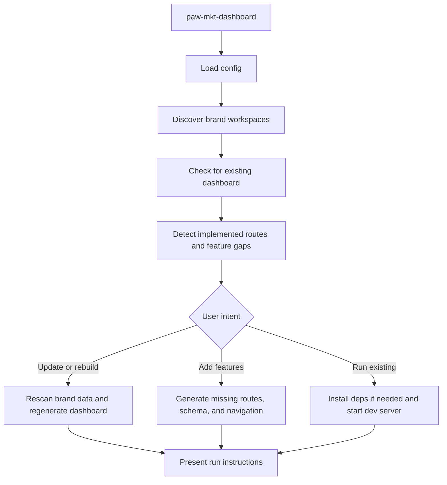

# paw-mkt-dashboard

## Overview

Generates self-contained SvelteKit + sql.js dashboards for marketing teams. The dashboard is built from actual brand workspace data, can detect missing features in an existing dashboard, and supports full CRUD plus JSON export and import.

## When to Use It

- You want a dashboard for an existing brand workspace
- You need a campaign tracker or strategy dashboard without building one from scratch
- You already have a dashboard and want to add missing features
- You want a local dashboard that works without native database dependencies

## What You Need to Provide

At minimum, the skill needs a brand workspace under:

```text
{project-root}/.pawbytes/marketing-suites/brands/{brand-slug}/
```

Helpful existing data includes:
- SOSTAC files
- campaign folders
- content files
- analytics and channel artifacts
- brand context files

If no brand workspace exists, run [paw-mkt-setup](./paw-mkt-setup.md) first.

## What It Does

| Capability | Description |
|------------|-------------|
| Brand discovery | Scans available brand workspaces automatically |
| Existing dashboard detection | Checks whether a brand already has a dashboard |
| Feature gap detection | Compares implemented routes against the full feature registry |
| Schema-aware generation | Designs tables and UI around the actual brand data structure |
| Full CRUD UI | Generates create, update, delete, filtering, and navigation flows |
| Export and import | Supports JSON export for git-friendly snapshots and import for restore flows |

## What You Get

| Output | Location |
|--------|----------|
| Launcher | `{project-root}/.pawbytes/marketing-suites/dashboards/launcher.html` |
| Brand dashboard | `{project-root}/.pawbytes/marketing-suites/brands/{brand-slug}/dashboard/` |
| Database | `{project-root}/.pawbytes/marketing-suites/brands/{brand-slug}/dashboard/data/dashboard.db` |
| Export data | `{project-root}/.pawbytes/marketing-suites/brands/{brand-slug}/dashboard/data/export/` |

## Output Location

```text
.pawbytes/marketing-suites/
├── dashboards/
│   └── launcher.html
└── brands/{brand-slug}/
    └── dashboard/
        ├── package.json
        ├── src/
        ├── data/
        │   ├── dashboard.db
        │   └── export/
        └── static/
```

## Workflow Overview



## Feature Registry Highlights

| Feature | Route | Purpose |
|---------|-------|---------|
| Campaign Tracker | `/campaigns` | Campaign status, milestones, deliverables |
| Content Pipeline | `/content` | Editorial calendar and publishing status |
| Strategy Overview | `/strategy` | SOSTAC and brand positioning visibility |
| Analytics Metrics | `/metrics` | KPIs, funnel metrics, conversion rates |
| Channel Performance | `/channels` | Per-channel reporting |
| Document Library | `/documents` | Read-only markdown rendering |
| Growth Experiments | `/experiments` | ICE-scored experiments |
| Revenue Tracker | `/revenue` | MRR, ARPU, pricing tiers |
| Customer Lifecycle | `/lifecycle` | Retention, churn, cohort health |
| Operations Hub | `/operations` | Team coordination and capacity |
| Export or Import API | `/api/export`, `/api/import` | Git-friendly data transfer |

## Arguments or Modes

| Mode | Behavior |
|------|----------|
| Interactive | Discovers brands and asks whether to run, update, add features, or rebuild |
| `--headless` / `-H` | Discovers brands and generates or regenerates automatically |
| Brand slug argument | Skips broad discovery and works directly on one brand |

## Behavior Notes

> [!IMPORTANT]
> Existing dashboards are not treated as static output. The skill can inspect them, detect missing features, and extend them instead of forcing a full rebuild.

> [!NOTE]
> This dashboard uses `sql.js`, not a native SQLite binding, so it avoids OS-specific compilation issues.

## Related Skills

- [paw-mkt-setup](./paw-mkt-setup.md) — Configure the module and create the base workspace first
- [paw-mkt-agency](./paw-mkt-agency.md) — Coordinator that builds the brand workspace context
- [paw-mkt-sostac](./paw-mkt-sostac.md) — Strategy inputs often displayed in the dashboard
- [paw-mkt-analytics](./paw-mkt-analytics.md) — Analytics structure and measurement inputs

## Example Prompts

```text
Create a dashboard for my brand Acme Corp.
```

```text
/paw-mkt-dashboard acme-corp
Add any missing dashboard features for this brand.
```

```text
/paw-mkt-dashboard --headless
Generate dashboards for all available brands.
```