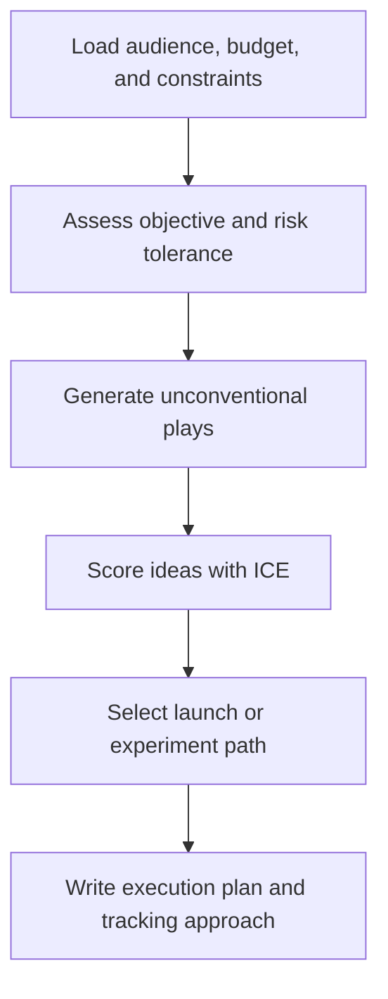

# paw-mkt-guerrilla

## Overview

Designs unconventional, high-leverage campaigns for attention and growth. Covers growth hacking, viral experiments, competitive disruption, and product-led growth opportunities that do not fit the standard channel playbook.

## When to Use It

- You need low-budget attention plays
- You want viral campaign design ideas
- You need growth experiment planning and tracking
- You want competitive disruption tactics or launch stunts
- You need Product Hunt or zero-budget launch concepts

## What You Need to Provide

- target audience context
- constraints and budget
- risk tolerance
- campaign objective
- any brand or legal limits

## What It Does

| Capability | Description |
|------------|-------------|
| Guerrilla concepts | Generates unconventional campaign ideas |
| Growth experiments | Builds testable experiment plans and dashboards |
| Launch stunts | Creates bold awareness concepts with safer backup options |
| Trend-based plays | Uses newsjacking and timing-sensitive hooks |
| Retrospectives | Helps analyze failed or mixed experiment outcomes |

## What You Get

- concept ideas with ICE scores
- growth experiment plans
- experiment dashboards
- execution outlines with do's and don'ts
- failed experiment analysis frameworks
- post-experiment retrospectives

## Output Location

```text
.pawbytes/marketing-suites/brands/{brand-slug}/campaigns/guerrilla/
```

## Workflow Overview



## Related Skills

- `paw-mkt-pr` — earned media and journalist outreach
- `paw-mkt-social` — organic social amplification
- `paw-mkt-launch` — structured launch planning
- `paw-mkt-community` — community building, not infiltration

## Example Prompts

```text
/paw-mkt-guerrilla
Give us three low-budget guerrilla campaign concepts.
```

```text
/paw-mkt-guerrilla
For Acorn Legal, design an unconventional awareness campaign that reaches small law firm owners without relying on paid ads.
```

```text
/paw-mkt-guerrilla
Use our positioning and budget constraints to create one bold launch stunt plus a safer backup version.
```