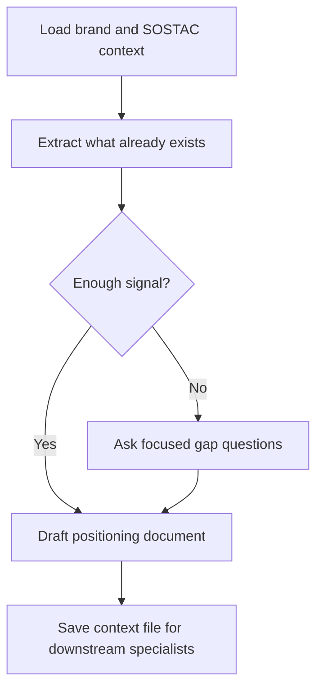

# paw-mkt-product-context

## Overview

Creates or updates the deep positioning file every specialist should read before producing marketing work. This document distills customer language, objections, proof, personas, and differentiation into a reusable strategic reference.

## When to Use It

- Output feels generic or off-brand
- You want better personas, objections, and proof points captured
- SOSTAC is complete and you want a distilled positioning reference
- You need stronger customer language for copywriting and execution

## What You Need to Provide

- active brand
- `brand-context.md`
- SOSTAC files if they exist
- customer quotes, objections, reviews, proof points, and personas if available

## What It Does

| Capability | Description |
|------------|-------------|
| Strategic extraction | Pulls positioning from existing SOSTAC and brand files |
| Gap interview | Asks only for missing details when needed |
| Positioning synthesis | Builds a structured, reusable positioning document |
| Messaging support | Captures customer language and proof for downstream specialists |

## What You Get

A 12-section positioning document covering:
- product overview
- audience and personas
- pain points
- competition
- differentiation
- objections
- customer language
- brand voice
- proof points
- marketing goals

## Output Location

```text
.pawbytes/marketing-suites/brands/{brand-slug}/paw-mkt-product-context.md
```

## Workflow Overview



## Related Skills

All specialists benefit from this file, especially:
- `paw-mkt-content`
- `paw-mkt-email`
- `paw-mkt-seo`
- `paw-mkt-social`
- `paw-mkt-paid-ads`
- `paw-mkt-sales`

## Example Prompts

```text
/paw-mkt-product-context
Create the product context for our brand.
```

```text
/paw-mkt-product-context
Use our completed SOSTAC plan to build this file, then ask me only about missing customer language and proof points.
```

```text
/paw-mkt-product-context
Refresh our existing positioning document with new objections, proof, and customer phrases from recent calls.
```