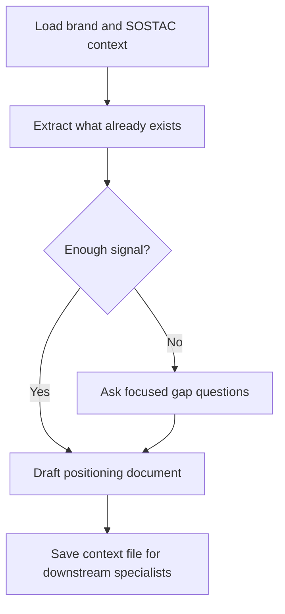

# paw-mkt-product-context

## Overview

Creates or updates the deep positioning file every specialist should read before producing marketing work. This document distills customer language, objections, proof, personas, and differentiation into a reusable strategic reference.

## When to Use It

- Output feels generic or off-brand
- You want better personas, objections, and proof points captured
- SOSTAC is complete and you want a distilled positioning reference
- You need stronger customer language for copywriting and execution

## What You Need to Provide

- active brand
- `brand-context.md`
- SOSTAC files if they exist
- customer quotes, objections, reviews, proof points, and personas if available

## What It Does

| Capability            | Description                                                                              |
| --------------------- | ---------------------------------------------------------------------------------------- |
| Strategic extraction  | Pulls positioning from existing SOSTAC and brand files                                   |
| Gap interview         | Asks only for missing details when needed                                                |
| Positioning synthesis | Builds a structured, reusable positioning document                                       |
| Messaging support     | Captures customer language and proof for downstream specialists                          |
| DDFF mapping          | Captures customer desires, dreams, fears, and frustrations as reusable motivation inputs |

## What You Get

A 12-section positioning document covering:

- product overview
- audience and personas
- pain points
- DDFF customer motivation map
- competition
- differentiation
- objections
- customer language
- brand voice
- proof points
- marketing goals

## DDFF Customer Motivation Structure

DDFF captures the customer motivation layer that downstream specialists use for copy, offers, campaigns, and sales messaging. Treat it as evidence-informed positioning input, not invented persona fiction.

| Field        | What to Capture                                                | Useful Evidence                                                          |
| ------------ | -------------------------------------------------------------- | ------------------------------------------------------------------------ |
| Desires      | The concrete outcomes, wins, or states they actively want      | Feature requests, purchase triggers, success metrics, jobs-to-be-done    |
| Dreams       | The bigger future the customer hopes to reach                  | Aspirational interview quotes, transformation language, long-term goals  |
| Fears        | The risks, losses, embarrassment, or regret they want to avoid | Objections, churn reasons, sales hesitations, review complaints          |
| Frustrations | The repeated irritations and blockers in their current reality | Support tickets, Reddit/G2 complaints, workflow pain, manual workarounds |

## Audience Pain Research Workflow

Use this workflow before finalizing DDFF when the audience is under-researched or the product context needs deeper pain, motivation, and customer-language inputs. Adapt the example prompts to the target segment, geography, and category.

| Step | Research Focus | Example Prompt | Feeds Into |
| ---- | -------------- | -------------- | ---------- |
| 1 | Physical pain points | Research the top physical and daily routine struggles the target audience faces. Focus on sleep deprivation, feeding difficulties, physical exhaustion, or equivalent daily frictions for the category. | Frustrations, Fears |
| 2 | Emotional and mental pain points | Research the emotional and psychological burdens the target audience carries. Include guilt, identity loss, anxiety, relationship strain, or equivalent emotional pressures. | Fears, Frustrations, limbic inputs |
| 3 | Financial pain points | Research financial pressures specific to the target audience and market. Include recurring costs, healthcare or operational costs, and opportunity costs. | Fears, Frustrations, reptilian inputs |
| 4 | Social and community pain points | Research social isolation, support-system gaps, belonging needs, and community pressures for the target audience. | Fears, Desires, limbic inputs |
| 5 | Information overload pain points | Research how the target audience is overwhelmed by conflicting advice, experts, social media, family, AI tools, or category authorities. | Frustrations, Fears |
| 6 | Aspirations and hidden desires | Research what the target audience secretly wishes for: not just problems, but dreams, identity, and who they want to become. | Desires, Dreams |
| 7 | Synthesis | Merge all research above into a comprehensive target audience profile. Identify the top 3 deepest pain points, their emotional triggers, and the exact language customers use to describe their struggles. | Persona, DDFF map, customer language, hot-button map |

Example specialized workflow for parents of toddlers in urban Indonesia:

```text
Step 1: Research the top physical and daily routine struggles parents face when raising toddlers aged 1-3. Focus on sleep deprivation, feeding difficulties, and physical exhaustion.

Step 2: Research the emotional and psychological burdens of parenting toddlers. Include mom guilt, identity loss, anxiety, and relationship strain with partner.

Step 3: Research financial pressures specific to parents with toddlers in Indonesia. Include daycare costs, formula, healthcare, and opportunity cost of career breaks.

Step 4: Research the social isolation and support system gaps experienced by young parents with toddlers, especially in urban Indonesia.

Step 5: Research how parents with toddlers are overwhelmed by conflicting parenting advice from doctors, social media, family, and AI tools.

Step 6: Research what parents with toddlers secretly wish for -- not just problems, but dreams, identity, and what they want to become.

Final synthesis: Merge all research above into a comprehensive target audience profile. Identify the top 3 deepest pain points, their emotional triggers, and the exact language they use to describe their struggles.
```

Recommended format inside `paw-mkt-product-context.md`:

```markdown
## Customer Motivation Map: DDFF

### Desires

- [Concrete outcome they are pursuing]

### Dreams

- [Future state they want, with quote or evidence]

### Fears

- [Risk, loss, embarrassment, or regret they want to avoid]

### Frustrations

- [Current pain, blocker, or recurring irritation]

### Highest-Leverage Motivation

**Primary emotional driver:** [desire/dream/fear/frustration]
**Evidence:** [quote, source, pattern, or confidence level]
**Messaging implication:** [how specialists should use this]
```

Use confidence labels when the evidence is uneven:

- **High**: repeated across multiple sources or segments
- **Medium**: appears in some evidence but needs more validation
- **Low**: plausible hypothesis that should be tested before heavy use

## Output Location

```text
.pawbytes/marketing-suites/brands/{brand-slug}/paw-mkt-product-context.md
```

## Workflow Overview


```mermaid
flowchart TD
    A[Load brand and SOSTAC context] --> B[Extract what already exists]
    B --> C{Enough signal?}
    C -- No --> D[Ask focused gap questions]
    C -- Yes --> E[Draft positioning document]
    D --> E
    E --> F[Save context file for downstream specialists]
```

## Related Skills

All specialists benefit from this file, especially:

- `paw-mkt-content`
- `paw-mkt-email`
- `paw-mkt-seo`
- `paw-mkt-social`
- `paw-mkt-paid-ads`
- `paw-mkt-sales`

## Example Prompts

```text
/paw-mkt-product-context
Create the product context for our brand.
```

```text
/paw-mkt-product-context
Use our completed SOSTAC plan to build this file, then ask me only about missing customer language and proof points.
```

```text
/paw-mkt-product-context
Refresh our existing positioning document with new objections, proof, and customer phrases from recent calls.
```
