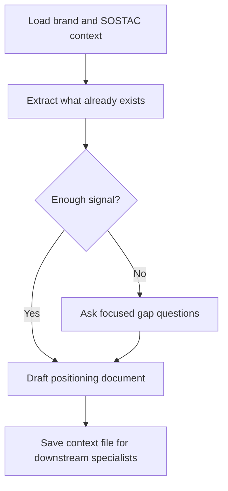

# paw-mkt-product-context

## Overview

Creates or updates the deep positioning file every specialist should read before producing marketing work. This document distills customer language, objections, proof, personas, and differentiation into a reusable strategic reference.

## When to Use It

- Output feels generic or off-brand
- You want better personas, objections, and proof points captured
- SOSTAC is complete and you want a distilled positioning reference
- You need stronger customer language for copywriting and execution

## What You Need to Provide

- active brand
- `brand-context.md`
- SOSTAC files if they exist
- customer quotes, objections, reviews, proof points, and personas if available

## What It Does

| Capability            | Description                                                                              |
| --------------------- | ---------------------------------------------------------------------------------------- |
| Strategic extraction  | Pulls positioning from existing SOSTAC and brand files                                   |
| Gap interview         | Asks only for missing details when needed                                                |
| Positioning synthesis | Builds a structured, reusable positioning document                                       |
| Messaging support     | Captures customer language and proof for downstream specialists                          |
| DDFF mapping          | Captures customer desires, dreams, fears, and frustrations as reusable motivation inputs |

## What You Get

A 12-section positioning document covering:

- product overview
- audience and personas
- pain points
- DDFF customer motivation map
- competition
- differentiation
- objections
- customer language
- brand voice
- proof points
- marketing goals

## DDFF Customer Motivation Structure

DDFF captures the customer motivation layer that downstream specialists use for copy, offers, campaigns, and sales messaging. Treat it as evidence-informed positioning input, not invented persona fiction.

| Field        | What to Capture                                                | Useful Evidence                                                          |
| ------------ | -------------------------------------------------------------- | ------------------------------------------------------------------------ |
| Desires      | The concrete outcomes, wins, or states they actively want      | Feature requests, purchase triggers, success metrics, jobs-to-be-done    |
| Dreams       | The bigger future the customer hopes to reach                  | Aspirational interview quotes, transformation language, long-term goals  |
| Fears        | The risks, losses, embarrassment, or regret they want to avoid | Objections, churn reasons, sales hesitations, review complaints          |
| Frustrations | The repeated irritations and blockers in their current reality | Support tickets, Reddit/G2 complaints, workflow pain, manual workarounds |

Recommended format inside `paw-mkt-product-context.md`:

```markdown
## Customer Motivation Map: DDFF

### Desires

- [Concrete outcome they are pursuing]

### Dreams

- [Future state they want, with quote or evidence]

### Fears

- [Risk, loss, embarrassment, or regret they want to avoid]

### Frustrations

- [Current pain, blocker, or recurring irritation]

### Highest-Leverage Motivation

**Primary emotional driver:** [desire/dream/fear/frustration]
**Evidence:** [quote, source, pattern, or confidence level]
**Messaging implication:** [how specialists should use this]
```

Use confidence labels when the evidence is uneven:

- **High**: repeated across multiple sources or segments
- **Medium**: appears in some evidence but needs more validation
- **Low**: plausible hypothesis that should be tested before heavy use

## Output Location

```text
.pawbytes/marketing-suites/brands/{brand-slug}/paw-mkt-product-context.md
```

## Workflow Overview


```mermaid
flowchart TD
    A[Load brand and SOSTAC context] --> B[Extract what already exists]
    B --> C{Enough signal?}
    C -- No --> D[Ask focused gap questions]
    C -- Yes --> E[Draft positioning document]
    D --> E
    E --> F[Save context file for downstream specialists]
```

## Related Skills

All specialists benefit from this file, especially:

- `paw-mkt-content`
- `paw-mkt-email`
- `paw-mkt-seo`
- `paw-mkt-social`
- `paw-mkt-paid-ads`
- `paw-mkt-sales`

## Example Prompts

```text
/paw-mkt-product-context
Create the product context for our brand.
```

```text
/paw-mkt-product-context
Use our completed SOSTAC plan to build this file, then ask me only about missing customer language and proof points.
```

```text
/paw-mkt-product-context
Refresh our existing positioning document with new objections, proof, and customer phrases from recent calls.
```
