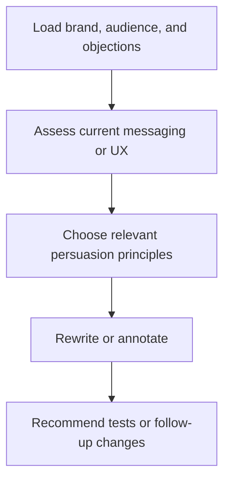

# paw-mkt-psychology

## Overview

Applies behavioral science and persuasion patterns to messaging, offers, and UX. This skill helps improve framing, objection handling, and trust-building by grounding recommendations in audience psychology.

## When to Use It

- You need stronger persuasion in copy
- You want framing help for offers or pages
- You need objection-handling ideas
- You want a bias-aware review of messaging or UX

## What You Need to Provide

- target audience
- current copy or flow
- desired action
- known objections
- brand voice constraints

## What It Does

| Capability | Description |
|------------|-------------|
| Persuasion recommendations | Applies principles like Cialdini and bias-aware framing |
| Messaging review | Annotates copy and offers with psychological guidance |
| Offer framing | Improves value communication and call-to-action logic |
| Before/after rewrites | Shows practical copy improvements with rationale |
| Strategic models | Applies mental models such as Jobs-to-be-Done where useful |

## What You Get

- persuasion recommendations
- annotated messaging guidance
- framing and offer suggestions
- rewritten copy examples with before/after
- psychology-by-context checklists
- strategic mental model recommendations

## Output Location

This skill is often advisory and may write into the active deliverable rather than a single dedicated folder.

## Workflow Overview



## Related Skills

- `paw-mkt-cro`
- `paw-mkt-email`
- `paw-mkt-paid-ads`
- `paw-mkt-sales`
- `paw-mkt-content`

## Example Prompts

```text
/paw-mkt-psychology
Review our homepage messaging and suggest stronger persuasion patterns.
```

```text
/paw-mkt-psychology
Use our audience objections to improve the framing of our webinar signup page.
```

```text
/paw-mkt-psychology
Audit this launch copy for weak framing, trust gaps, and missed behavioral triggers.
```