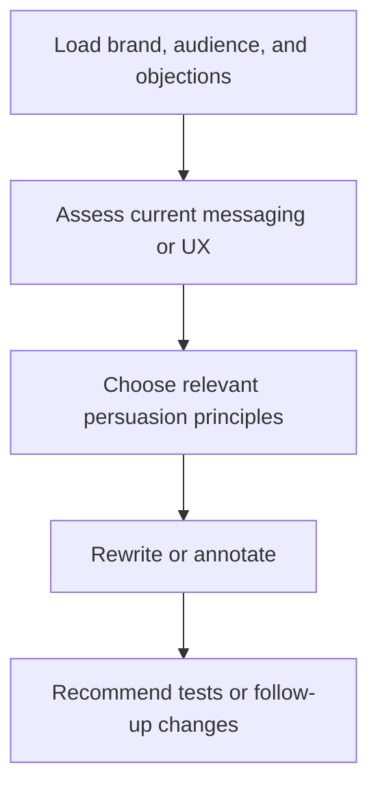

# paw-mkt-psychology

## Overview

Applies behavioral science and persuasion patterns to messaging, offers, and UX. This skill helps improve framing, objection handling, and trust-building by grounding recommendations in audience psychology.

## When to Use It

- You need stronger persuasion in copy
- You want framing help for offers or pages
- You need objection-handling ideas
- You want a bias-aware review of messaging or UX

## What You Need to Provide

- target audience
- current copy or flow
- desired action
- known objections
- brand voice constraints

## What It Does

| Capability                 | Description                                                           |
| -------------------------- | --------------------------------------------------------------------- |
| Persuasion recommendations | Applies principles like Cialdini and bias-aware framing               |
| Messaging review           | Annotates copy and offers with psychological guidance                 |
| Offer framing              | Improves value communication and call-to-action logic                 |
| Before/after rewrites      | Shows practical copy improvements with rationale                      |
| Strategic models           | Applies mental models such as Jobs-to-be-Done where useful            |
| Hot-button mapping         | Identifies primal and emotional buying triggers from audience context |

## What You Get

- persuasion recommendations
- annotated messaging guidance
- framing and offer suggestions
- rewritten copy examples with before/after
- psychology-by-context checklists
- reptilian and limbic hot-button maps
- strategic mental model recommendations

## Reptilian and Limbic Hot-Button Framework

Use this as practical shorthand for buyer motivation, not as a literal neuroscience claim. The goal is to identify the strongest ethical trigger behind a desired action, then translate it into clear messaging, offers, and tests.

| Hot-button type      | Meaning                                                                                 | Best used for                                                                        | Guardrail                                          |
| -------------------- | --------------------------------------------------------------------------------------- | ------------------------------------------------------------------------------------ | -------------------------------------------------- |
| Reptilian hot-button | The immediate survival, safety, loss, urgency, status-threat, or risk-avoidance trigger | Headlines, CTAs, landing pages, paid ads, sales objections, high-friction decisions  | Do not manufacture fear, scarcity, or urgency      |
| Limbic hot-button    | The emotional, identity, belonging, aspiration, trust, relief, or pride trigger         | Storytelling, nurture sequences, brand messaging, social proof, community, retention | Do not exploit insecurity or misrepresent outcomes |

Recommended diagnostic flow:

1. Read `paw-mkt-product-context.md`, especially DDFF, objections, proof, and customer language.
2. If an Audience Pain Research Workflow exists, use its synthesis before creating the hot-button map.
3. Identify the desired action: click, sign up, book, buy, upgrade, stay, refer, or reply.
4. Choose the dominant trigger:
   - Use a reptilian hot-button when the customer is avoiding risk, loss, wasted time, wasted money, embarrassment, uncertainty, or inaction.
   - Use a limbic hot-button when the customer is pursuing identity, pride, belonging, relief, confidence, aspiration, mastery, or trust.
5. Convert the trigger into a message hypothesis.
6. Apply the ethics test: would the customer feel well-served if they knew this framing was being used?

Output format:

```markdown
## Hot-Button Map

**Desired action:** [action]
**Primary DDFF input:** [desire/dream/fear/frustration]
**Reptilian hot-button:** [risk/loss/status/safety/urgency trigger]
**Limbic hot-button:** [identity/trust/relief/aspiration/belonging trigger]
**Recommended framing:** [message angle]
**Proof needed:** [evidence that makes the framing credible]
**Ethics check:** Passed / Needs revision
**Test idea:** [copy, offer, page, ad, or email test]
```

Use both buttons when useful, but choose one primary driver per asset. Mixed emotional signals usually weaken copy.

## Output Location

This skill is often advisory and may write into the active deliverable rather than a single dedicated folder.

## Workflow Overview


```mermaid
flowchart TD
    A[Load brand, audience, and objections] --> B[Assess current messaging or UX]
    B --> C[Choose relevant persuasion principles]
    C --> D[Rewrite or annotate]
    D --> E[Recommend tests or follow-up changes]
```

## Related Skills

- `paw-mkt-cro`
- `paw-mkt-email`
- `paw-mkt-paid-ads`
- `paw-mkt-sales`
- `paw-mkt-content`

## Example Prompts

```text
/paw-mkt-psychology
Review our homepage messaging and suggest stronger persuasion patterns.
```

```text
/paw-mkt-psychology
Use our audience objections to improve the framing of our webinar signup page.
```

```text
/paw-mkt-psychology
Audit this launch copy for weak framing, trust gaps, and missed behavioral triggers.
```
