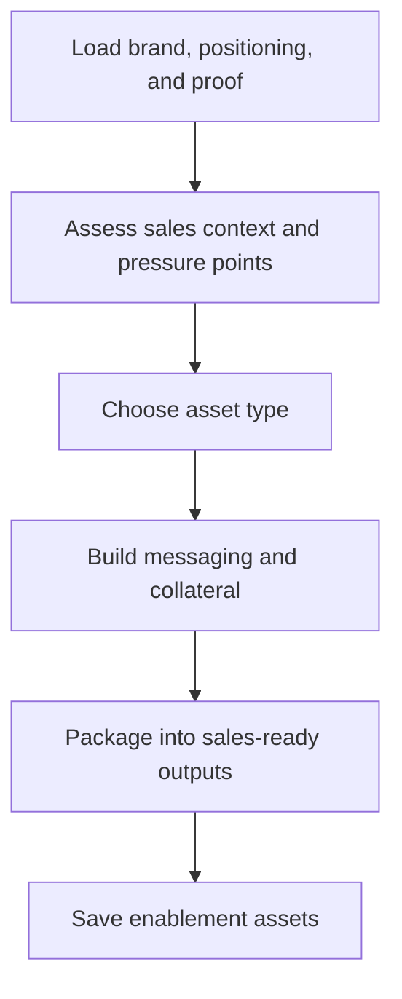

# paw-mkt-sales

## Overview

Creates sales enablement assets and messaging systems for the revenue team. This skill covers collateral from first contact through close so sales conversations stay aligned with brand positioning and proof.

## When to Use It

- You need sales decks or pitch decks
- You want one-pagers or battle cards
- You need objection handling docs, demo scripts, or talk tracks
- You want ROI calculators or champion kits
- You need competitive positioning for sales conversations

## What You Need to Provide

- ICP and segment details
- common objections
- sales stage context
- competitor or pricing pressure
- product proof and outcomes
- existing collateral library if available

## What It Does

| Capability | Description |
|------------|-------------|
| Decks and one-pagers | Creates structured sales collateral |
| Battle cards | Produces concise and detailed competitive enablement |
| Objection handling | Builds talk tracks and rebuttal frameworks |
| Demo scripts | Creates structured product presentation flows |
| ROI tools | Frames value in business terms for buyers |
| Sales library management | Organizes collateral and reuse patterns |

## What You Get

| Deliverable | Description |
|-------------|-------------|
| Sales decks | Slide-ready structure and key messaging |
| One-pagers | Compact product or offer explanation |
| Battle cards | Competitive and objection-handling support |
| Demo scripts | Guided walkthroughs for product conversations |
| ROI calculator templates | Value framing and savings logic |
| Champion kits | Internal-selling support for buyer champions |

## Output Location

```text
.pawbytes/marketing-suites/brands/{brand-slug}/campaigns/sales/
```

## Workflow Overview



## Related Skills

- `paw-mkt-email` — sales outreach sequences
- `paw-mkt-pricing` — pricing strategy for ROI messaging
- `paw-mkt-cro` — landing page alignment with sales messaging
- `paw-mkt-product-context` — positioning and customer language that feed all sales copy

## Example Prompts

```text
/paw-mkt-sales
Create a one-pager for our product.
```

```text
/paw-mkt-sales
For Acorn Legal, build objection-handling and demo messaging for small law firm owners.
```

```text
/paw-mkt-sales
Use our positioning, proof points, and pricing strategy to draft a sales deck outline.
```