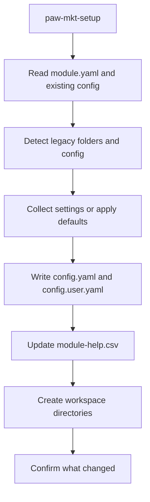

# paw-mkt-setup

## Overview

Sets up and configures the Marketing Suite module in a project. It installs shared and user configuration, prepares the `.pawbytes/marketing-suites/` workspace, and can migrate older layouts into the current structure.

## When to Use It

- First-time installation of the Marketing Suite
- Reconfiguring module settings
- Migrating older marketing workspace layouts into the current `.pawbytes/` structure
- Preparing a project before using `paw-mkt-agent-agency` or other marketing skills

## What You Need to Provide

The setup flow can collect everything interactively, but it is designed to gather all values in one pass.

Typical values include:
- output folder
- user name
- communication language
- document output language

If existing values already exist in config, those are reused as defaults.

## What It Does

| Capability | Description |
|------------|-------------|
| Configuration setup | Writes shared and user-specific config files |
| Directory initialization | Creates `.pawbytes/marketing-suites/` and core subfolders |
| Help registration | Updates `module-help.csv` so the module is discoverable |
| Legacy migration | Moves older `brands/`, `reports/`, and module config layouts into the current structure |
| Safe refresh | Removes stale module entries before writing fresh values |

## What You Get

| Output | Location |
|--------|----------|
| Shared config | `{project-root}/.pawbytes/config/config.yaml` |
| User config | `{project-root}/.pawbytes/config/config.user.yaml` |
| Module help registry | `{project-root}/.pawbytes/config/module-help.csv` |
| Marketing workspace | `{project-root}/.pawbytes/marketing-suites/` |
| Brand workspace root | `{project-root}/.pawbytes/marketing-suites/brands/` |
| Reports root | `{project-root}/.pawbytes/marketing-suites/reports/` |

## Output Location

The canonical Marketing workspace lives under:

```text
{project-root}/.pawbytes/marketing-suites/
```

Important path rules:
- `{project-root}` is stored as a literal token in config values
- user-only values such as `user_name` and `communication_language` belong in `config.user.yaml`
- shared module settings belong in `config.yaml`

## Workflow Overview



## Arguments or Modes

| Mode | Behavior |
|------|----------|
| Interactive | Prompts for values with defaults shown |
| `--headless` | Applies provided values and defaults without interactive prompting |
| Inline values | Uses values passed in the request and skips repeated questions |

## Behavior Notes

> [!IMPORTANT]
> Existing values take priority over defaults. Migrated legacy values are used when no current value exists.

> [!IMPORTANT]
> The setup flow uses an anti-zombie pattern: old entries for this module are removed before fresh values are written, so stale config does not linger.

> [!NOTE]
> If older layouts are found under `brands/`, `reports/`, or legacy config folders, they are migrated into `.pawbytes/marketing-suites/` automatically.

## Related Skills

- [paw-mkt-agent-agency](./paw-mkt-agent-agency.md) — Central coordinator after setup
- [paw-mkt-sostac](./paw-mkt-sostac.md) — Strategy planning after onboarding
- [New Brand Onboarding](../workflows/new-brand-onboarding.md) — First brand workspace flow after setup

## Example Prompts

```text
/paw-mkt-setup
```

```text
/paw-mkt-setup --headless
Use the default marketing workspace, set my name to Nadia, and use English for communication and documents.
```

```text
Install the marketing suite in this project and migrate any existing brand folders into the new structure.
```