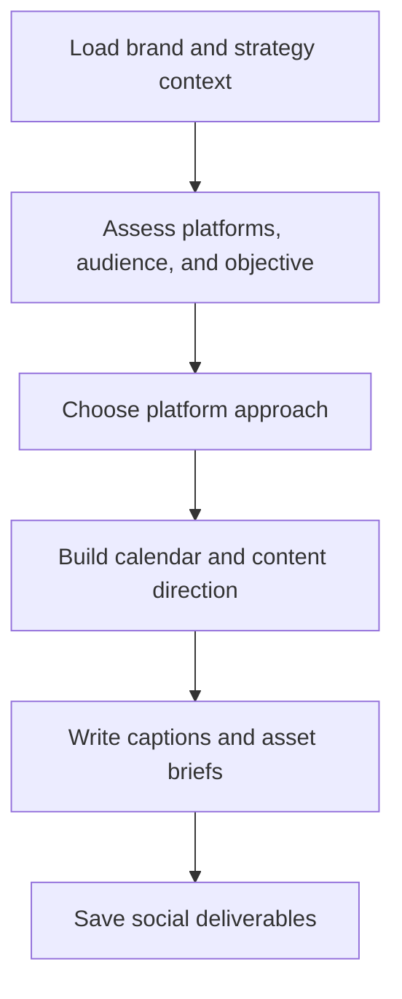

# paw-mkt-social

## Overview

Plans and creates organic social strategy, calendars, and platform-specific content. This skill helps turn strategic messaging into channel-appropriate social execution across major platforms.

## When to Use It

- You need a social content calendar
- You want platform strategy guidance
- You need post ideas, captions, or UGC campaign direction
- You want channel-specific recommendations for LinkedIn, TikTok, Instagram, X, Reddit, and more

## What You Need to Provide

- target platforms
- audience and voice
- campaign objective
- content themes or offers
- posting cadence

## What It Does

| Capability | Description |
|------------|-------------|
| Social calendars | Plans social publishing rhythm and themes |
| Platform strategy | Recommends how to approach each platform differently |
| Content briefs | Turns strategy into social-ready briefs |
| Caption libraries | Produces channel-appropriate post copy |
| UGC campaign planning | Designs user-generated content concepts and participation hooks |

## What You Get

| Deliverable | Description |
|-------------|-------------|
| Social calendar | Platform-by-platform publishing plan |
| Platform strategy | Guidance for tone, format, and content mix |
| Content briefs | Inputs for posts, carousels, or video assets |
| Caption library | Draft copy ready for editing and publishing |
| UGC plan | Direction for user participation and social proof |

## Output Location

```text
.pawbytes/marketing-suites/brands/{brand-slug}/content/social/
```

## Workflow Overview



## Related Skills

- `paw-mkt-content`
- `paw-mkt-video`
- `paw-mkt-community`
- `paw-mkt-influencer`
- `paw-mkt-launch`

## Example Prompts

```text
/paw-mkt-social
Create a monthly social plan.
```

```text
/paw-mkt-social
For Acorn Legal, build a LinkedIn-first strategy for reaching managing partners at small firms.
```

```text
/paw-mkt-social
Use our launch messaging to draft a week of social posts across LinkedIn and X.
```