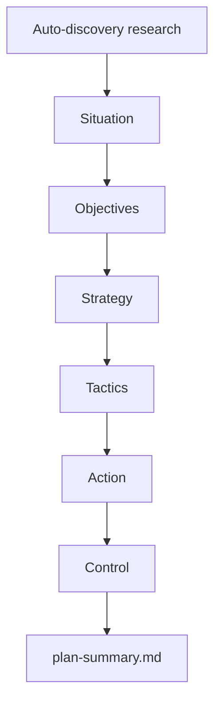

# paw-mkt-sostac

## Overview

Builds a full SOSTAC marketing plan by researching first and delivering strategic recommendations, not by running a long interview. The skill does the analysis work, then validates findings with the user before saving each phase.

## When to Use It

- You need a full marketing plan
- Current tactics feel disconnected
- You want strategy saved to files for future sessions
- A coordinator routed you here before execution

## What You Need to Provide

Nothing is strictly required upfront because the skill starts with auto-discovery research. Helpful inputs include:
- brand website or URL
- product overview or description
- known competitors
- goals or KPIs
- budget and team constraints

## What It Does

| Phase | What Happens | Output |
|-------|--------------|--------|
| 0 — Auto-Discovery | Automated web research before first user interaction | `00-auto-discovery.md` |
| 1 — Situation | Competitive analysis, SWOT, market sizing | `01-situation.md` |
| 2 — Objectives | Benchmarked OKR and KPI recommendations | `02-objectives.md` |
| 3 — Strategy | Positioning, segments, and channel strategy | `03-strategy.md` |
| 4 — Tactics | Channel-level execution plan with ICE scoring | `04-tactics.md` |
| 5 — Action | Roadmap, ownership, and timeline | `05-action.md` |
| 6 — Control | KPI dashboards and review cadences | `06-control.md` |

After the six phases, the skill writes `plan-summary.md`.

## What You Get

- `00-auto-discovery.md` — pre-research synthesis
- six phase files (`01-situation.md` through `06-control.md`)
- `plan-summary.md` — executive summary
- a durable strategic foundation for downstream specialists

## Output Location

```text
.pawbytes/marketing-suites/brands/{brand-slug}/sostac/
```

## Workflow Overview



## Behavior Notes

> [!IMPORTANT]
> The core interaction model is Research → Recommend → Validate. The user should feel like they hired a strategist who shows up prepared, not one who shows up with a clipboard.

> [!NOTE]
> The skill resumes from the first incomplete phase by reading `sostac/README.md` and existing phase files before continuing.

## Related Skills

- `paw-mkt-agency` — routes to SOSTAC when no plan exists
- `paw-mkt-product-context` — run after SOSTAC to build the deeper positioning document
- all execution specialists — feed from SOSTAC output

## Example Prompts

```text
/paw-mkt-sostac
Build a complete marketing plan for our brand.
```

```text
/paw-mkt-sostac
Continue the existing SOSTAC plan for Acorn Legal from the next incomplete phase.
```

```text
/paw-mkt-sostac
We sell a workflow tool for recruiting teams. We need a strategy before investing more in SEO, paid ads, and email.
```