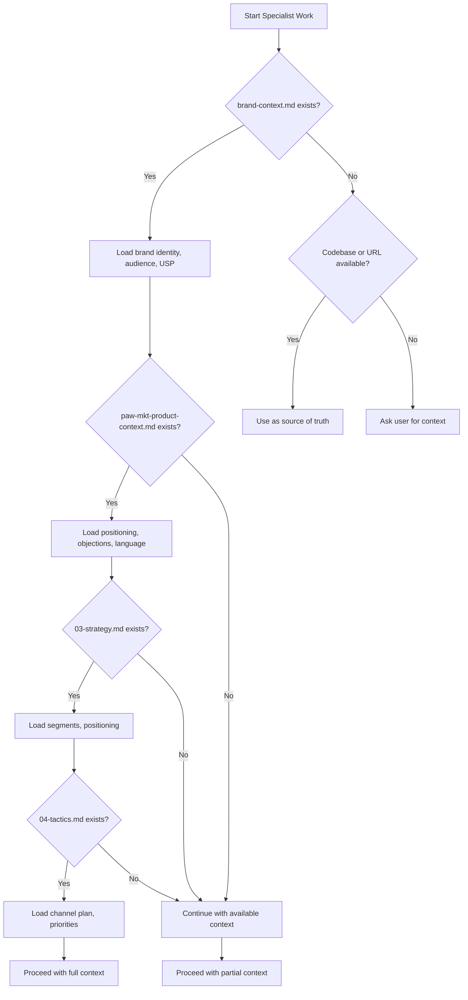
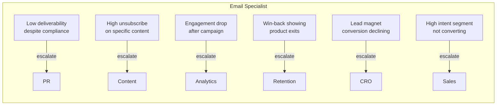
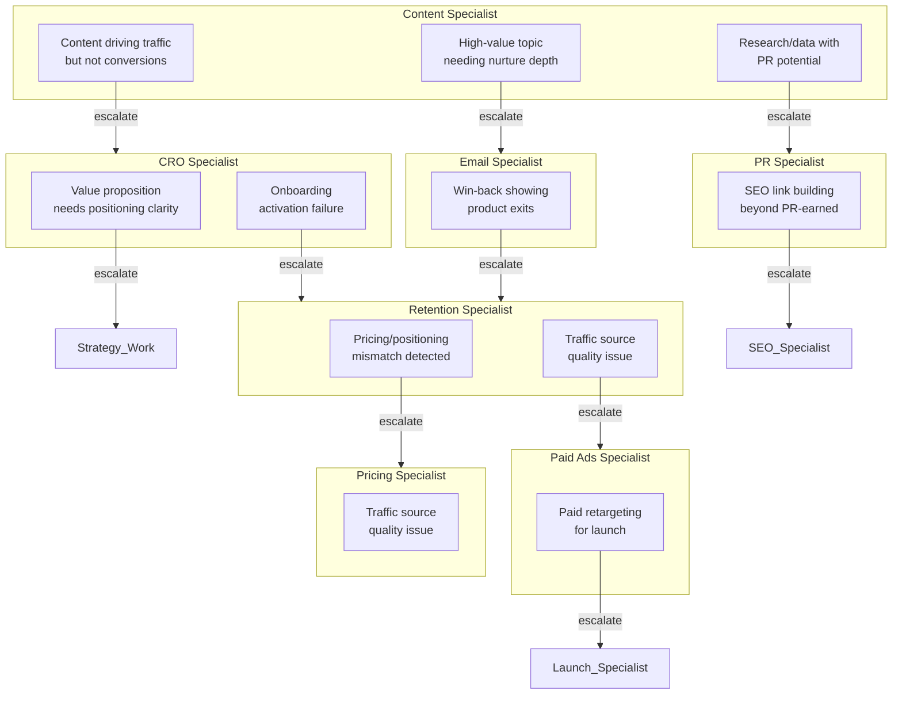
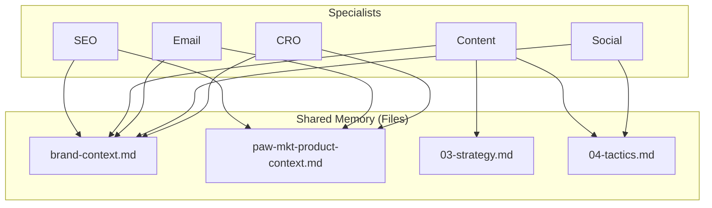
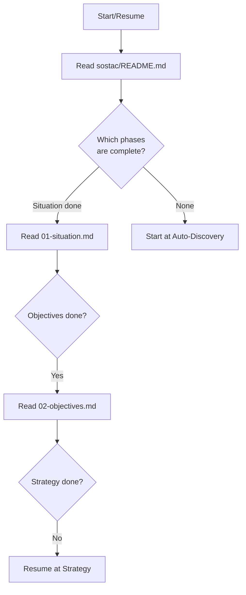
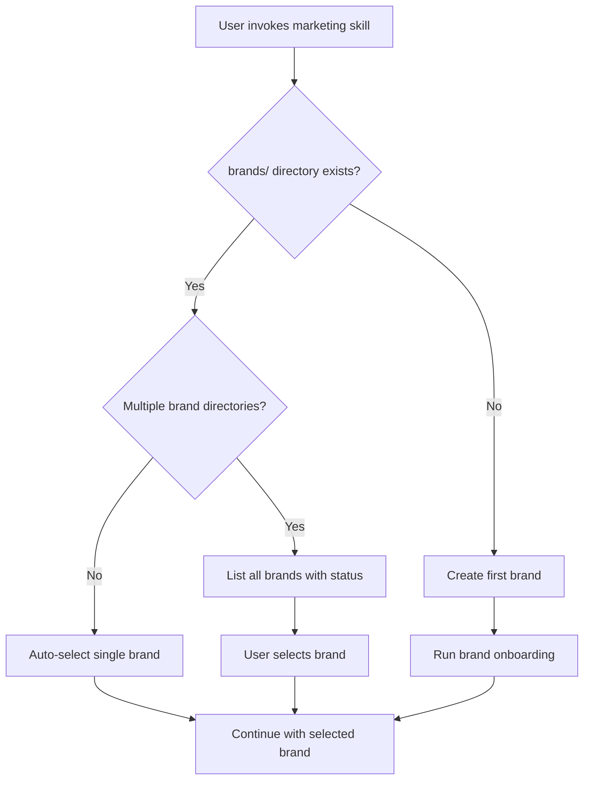

# Part 4: How Skills Work Together

This section explains the underlying architecture that makes the Agentic Marketing Skills system function as a cohesive whole rather than a collection of isolated tools.

---

## Chapter 10: The Workflow Architecture

### 10.1 The Orchestrator Pattern Explained

The Agentic Marketing Skills system uses an **orchestrator pattern** where a central coordinator manages the flow of requests across specialized skills. This is not a simple router that just forwards requests — it is an intelligent system that:

1. **Assesses context** before routing
2. **Maintains brand state** across sessions
3. **Spawns and coordinates** specialist teams
4. **Tracks progress** across all work

```
+-------------------+
|   User Request    |
+---------+---------+
          |
          v
+---------+---------+
| paw-mkt-agent-agency  |  <-- THE ORCHESTRATOR
|   (Coordinator)   |
+---------+---------+
          |
    +-----+-----+-----+-----+-----+
    |     |     |     |     |     |
    v     v     v     v     v     v
+------+ +------+ +------+ +------+ +------+
| SEO  | |Content| |Email | |Social| | CRO  |
+------+ +------+ +------+ +------+ +------+
```

#### Why This Pattern Matters

Without orchestration, each marketing request would require you to:
- Know which specialist skill to invoke
- Provide complete context every time
- Manually coordinate outputs between specialists
- Remember what work has been done

With orchestration, the system:
- Reads existing brand files automatically
- Routes to the correct specialist
- Maintains consistency across all outputs
- Tracks progress in a persistent workspace

#### The Coordinator's Responsibilities

| Responsibility | How It Works |
|----------------|--------------|
| **Context Loading** | Reads `brand-context.md`, SOSTAC files, and campaign data before any routing |
| **Brand Selection** | Presents available brands when multiple exist, with status summaries |
| **Gap Detection** | Identifies missing strategy and routes to SOSTAC planning first |
| **Team Assembly** | Spawns the right combination of specialists based on Tactics phase |
| **Progress Tracking** | Reads all workspace files to report current status |

---

### 10.2 Context Routing (How Your Request Gets to the Right Place)

Every request flows through a three-layer context assessment before reaching a specialist.

#### Layer 1: Starting Context Mode

The system first determines your starting point:

```
+------------------+     +-------------------+     +------------------+
|  Context A:      |     |  Context B:       |     |  Context C:      |
|  Blank Page      |     |  Existing         |     |  Live URL        |
|  (Strategy Work) |     |  Codebase         |     |  (Audit Mode)    |
+--------+---------+     +--------+----------+     +--------+---------+
         |                        |                         |
         v                        v                         v
   Read brand/SOSTAC       Deep codebase audit      Audit live experience
   context first           before proposing          as source of truth
                          changes
```

| Mode | When Used | First Action |
|------|-----------|--------------|
| **Context A: Blank Page** | Strategy, planning, fresh roadmap | Read brand and SOSTAC files |
| **Context B: Codebase** | Implementation in existing repo | Inspect stack, architecture, patterns |
| **Context C: Live URL** | Public URL provided for review | Audit live page as source of truth |

#### Layer 2: Pre-Flight Context Loading

Before any specialist work, the system attempts to read strategic context files in order:



#### Layer 3: Specialist Routing

Finally, the system routes to the appropriate specialist based on your request:

| Request Keywords | Routes To |
|------------------|-----------|
| SEO, keywords, rankings, schema, pSEO, GEO | `paw-mkt-seo` |
| Blog, article, whitepaper, case study, editorial | `paw-mkt-content` |
| Email, newsletter, sequence, automation, deliverability | `paw-mkt-email` |
| Social, Instagram, LinkedIn, TikTok, organic | `paw-mkt-social` |
| PPC, ads, paid social, retargeting, display | `paw-mkt-paid-ads` |
| CRO, conversion, landing page, A/B test, signup | `paw-mkt-cro` |
| Churn, retention, cancel flow, dunning, win-back | `paw-mkt-retention` |
| Launch, GTM, Product Hunt, announcement | `paw-mkt-launch` |
| PR, press release, journalist, media, crisis | `paw-mkt-pr` |
| Influencer, creator, UGC, partnership | `paw-mkt-influencer` |
| Pricing, tiers, packaging, value metric | `paw-mkt-pricing` |
| Video, YouTube, TikTok production, webinar | `paw-mkt-video` |
| Community, Discord, forum, user group | `paw-mkt-community` |
| Referral, affiliate, partnership program | `paw-mkt-referral` |
| Analytics, GA4, GTM, dashboard, tracking | `paw-mkt-analytics` |
| Sales deck, one-pager, objection handling | `paw-mkt-sales` |
| Psychology, persuasion, behavioral science | `paw-mkt-psychology` |
| Guerrilla, growth hack, unconventional | `paw-mkt-guerrilla` |

---

### 10.3 The Escalation System

The escalation system enables specialists to hand off work when they detect signals outside their expertise. This is a **bidirectional** system — specialists can both escalate out and receive escalated work.

#### What Triggers Escalation

Specialists monitor for specific signals that indicate another specialist should handle part of the work:



#### Example Escalation Chains

Here is a visual diagram showing how escalations flow through the system:



#### How Handoffs Work

When a specialist detects an escalation signal:

1. **Complete current work** — Finish the primary task first
2. **Document the signal** — Explain what was detected and why it matters
3. **Recommend next specialist** — Name the specific skill to route to
4. **Preserve context** — The escalation carries forward all relevant context

Example handoff message:

```
I've completed your email sequence. However, I noticed your lead magnet
landing page has a 12% conversion rate (industry benchmark: 25-30%).

**Recommendation**: Route to `paw-mkt-cro` for landing page optimization
before sending traffic to this sequence.

**Context to share**: The email sequence assumes the lead magnet page
converts at 25%+. Current performance will significantly impact your
projected list growth.
```

#### Complete Escalation Reference Table

| From Specialist | Signal Detected | Escalate To | Reason |
|-----------------|-----------------|-------------|--------|
| Content | Traffic but no conversions | CRO | Conversion path optimization needed |
| Content | Topic needs nurture depth | Email | Adapt into sequence |
| Content | Data with PR potential | PR | Earned media opportunity |
| Content | Funnel stage gaps | Analytics | Priority content analysis |
| Email | Low deliverability | PR | Sender reputation work |
| Email | High unsubscribe | Content | Content relevance issue |
| Email | Engagement drop | Analytics | Performance analysis |
| Email | Product exits in win-back | Retention | Product-level churn |
| Email | Declining lead magnet | CRO | Landing page optimization |
| SEO | Content gaps | Content | Content production |
| SEO | Technical issues | Dev | Implementation needed |
| CRO | Value prop unclear | Strategy | Positioning work |
| CRO | Onboarding failure | Retention | Activation work |
| Retention | Pricing mismatch | Pricing | Pricing strategy review |
| Retention | Traffic quality issue | Paid Ads | Acquisition quality |
| Social | Crisis escalation | PR | Reputation management |
| Social | Paid social need | Paid Ads | Advertising setup |
| Launch | Press outreach | PR | Media relations |
| Launch | Retargeting | Paid Ads | Paid campaign setup |
| PR | SEO links beyond PR | SEO | Link building strategy |
| PR | Influencer campaigns | Influencer | Creator partnerships |

---

### 10.4 Shared Memory and Brand Context

The system uses the **file system as its source of truth**. This means:

- All critical information is written to files, not stored in memory
- Future sessions can resume from real artifacts
- Multiple specialists can access the same brand context
- Progress persists across conversation restarts

#### The Brand Context Files

Every brand workspace contains files that serve as shared memory:

```
.pawbytes/marketing-suites/brands/{brand-slug}/
    brand-context.md              # Core identity, voice, audience, USP
    paw-mkt-product-context.md  # Deep positioning, objections, language
    sostac/                       # Strategic plan (6 phases)
    campaigns/                    # Named campaign work
    channels/                     # Standalone channel work
    operations/                   # Operational discipline work
    analytics/                    # Reports and metrics
```

#### How Specialists Use Shared Memory



Every specialist reads these files before starting work:

1. **brand-context.md** — Who we are, who we serve, how we're different
2. **paw-mkt-product-context.md** — Deep positioning, customer language, objection handling
3. **sostac/03-strategy.md** — Target segments and positioning decisions
4. **sostac/04-tactics.md** — Channel priorities and tactical direction

This ensures every piece of content, every email, and every campaign aligns with the same strategic foundation.

---

### 10.5 Cross-Skill Communication

Skills communicate through **files**, not direct messaging. This creates a durable, auditable trail of all work.

#### File-Based Communication Pattern

```
+-------------+         +------------------+         +-------------+
|   Skill A   | ------ | Output File      | ------ |   Skill B   |
| (e.g., SEO) |  write | (e.g., keywords) |  read  | (e.g.,      |
|             |         |                  |         |  Content)   |
+-------------+         +------------------+         +-------------+
```

Example flow:

1. **SEO Specialist** writes `channels/seo/content/keyword-research.md`
2. **Content Specialist** reads that file to inform blog topics
3. **Email Specialist** reads content outputs to create nurture sequences
4. **Analytics Specialist** reads all outputs to set up tracking

#### Campaign-Level Coordination

When working within a campaign, skills coordinate through the campaign structure:

```
campaigns/launch-spring-release/
    strategy.md                    <-- All specialists read this
    channels/
        email/content/             <-- Email outputs here
        social/content/            <-- Social outputs here
        blog/content/              <-- Content outputs here
    performance/                   <-- Analytics writes here
```

The `strategy.md` file serves as the coordination document that all specialists read before starting campaign work.

#### Cross-Skill Dependencies

Some work requires multiple specialists in sequence:

```
+----------+     +----------+     +----------+     +----------+
| Strategy | --> | Content  | --> |   SEO    | --> | Email    |
| (SOSTAC) |     | (Blog)   |     |(Optimize)|     |(Nurture) |
+----------+     +----------+     +----------+     +----------+
     |                |                |                |
     v                v                v                v
04-tactics.md   blog/content/    seo/content/    email/content/
                 pillar-pages/   optimizations/  sequences/
```

---

## Chapter 11: The SOSTAC Framework Integration

### 11.1 Why SOSTAC Matters

SOSTAC is the strategic backbone of the entire Agentic Marketing Skills system. Every specialist skill, every campaign, and every piece of content should trace back to the SOSTAC plan.

**SOSTAC** stands for:

- **S**ituation — Where are we now?
- **O**bjectives — Where do we want to be?
- **S**trategy — How do we get there?
- **T**actics — How exactly do we execute?
- **A**ction — What is our plan and timeline?
- **C**ontrol — How do we measure success?

#### Why This Framework?

| Without SOSTAC | With SOSTAC |
|----------------|-------------|
| Tactics disconnected from goals | Every tactic serves a documented objective |
| Inconsistent messaging across channels | Unified positioning from Strategy phase |
| No clear success criteria | Measurable KPIs defined in Control phase |
| Specialists work in silos | Shared strategic document for coordination |
| Random acts of marketing | Coordinated, phased execution |

#### The Cascading Effect

Each phase builds on the previous one:

```
Situation  -->  Identifies gaps and opportunities
    |
    v
Objectives -->  Sets targets that address Situation gaps
    |
    v
Strategy   -->  Defines approach to reach Objectives
    |
    v
Tactics    -->  Chooses methods that execute Strategy
    |
    v
Action     -->  Creates timeline to implement Tactics
    |
    v
Control    -->  Measures whether Objectives were achieved
```

---

### 11.2 The 6 Phases Deep Dive

#### Situation: Understanding Where You Are

The Situation phase establishes your starting point through research and analysis.

**Key Questions Answered:**
- What is our current market position?
- Who are our competitors and what are they doing?
- What are our strengths, weaknesses, opportunities, and threats?
- Where do we stand on digital maturity?

**Frameworks Used:**

| Framework | Purpose |
|-----------|---------|
| SWOT + TOWS | Internal/external analysis, strategic options |
| PESTLE | Macro-environment scanning |
| Porter's Five Forces | Industry attractiveness, competitive dynamics |
| TAM/SAM/SOM | Market sizing |
| Jobs-to-be-Done | Customer motivation research |
| Digital Maturity (5S) | Baseline capability assessment |

**Output:** `sostac/01-situation.md`

---

#### Objectives: Setting Measurable Goals

The Objectives phase defines where you want to be with specific, measurable targets.

**Key Questions Answered:**
- What are our marketing goals?
- How will we measure success?
- What are the Key Results for each Objective?

**Frameworks Used:**

| Framework | Purpose |
|-----------|---------|
| OKR Framework | Objectives with measurable Key Results |
| RACE Framework | Funnel-stage coverage (Reach, Act, Convert, Engage) |
| 5S Objectives | Sell, Serve, Speak, Save, Sizzle categories |
| Objective Cascade | Revenue goal broken into channel targets |

**Output:** `sostac/02-objectives.md`

---

#### Strategy: Defining Your Approach

The Strategy phase determines how you will reach your objectives.

**Key Questions Answered:**
- Which segments will we target?
- How will we position ourselves?
- What is our competitive advantage?

**Frameworks Used:**

| Framework | Purpose |
|-----------|---------|
| STP | Segmentation, Targeting, Positioning |
| Moore's Positioning Statement | Differentiation messaging |
| Ansoff Matrix | Growth direction (market vs product) |
| Porter's Generic Strategies | Competitive approach |
| Blue Ocean | Uncontested market space |
| Value Proposition Canvas | Product-market fit validation |
| Customer Journey Mapping | Touchpoint identification |

**Output:** `sostac/03-strategy.md`

---

#### Tactics: Choosing Your Methods

The Tactics phase selects specific channels and methods to execute the strategy.

**Key Questions Answered:**
- Which channels will we use?
- What tactics will we employ on each channel?
- How do we prioritize limited resources?

**Frameworks Used:**

| Framework | Purpose |
|-----------|---------|
| AARRR Pirate Metrics | Funnel diagnosis and prioritization |
| ICE Scoring | Tactic prioritization |
| PIE Framework | CRO experiment prioritization |
| Hub-Hero-Help | Content production cadence |
| Pillar-Cluster | SEO content architecture |
| TOFU/MOFU/BOFU | Funnel content mapping |
| 7P Marketing Mix | Comprehensive tactical coverage |
| 70/20/10 Budget | Resource allocation |

**Output:** `sostac/04-tactics.md`

---

#### Action: Executing the Plan

The Action phase creates the implementation timeline and assigns responsibilities.

**Key Questions Answered:**
- Who does what and when?
- What is the timeline and sequence?
- What resources are required?

**Frameworks Used:**

| Framework | Purpose |
|-----------|---------|
| RACI Matrix | Responsibility assignment |
| Agile Sprints | Time-boxed execution cycles |
| Objective-Task Budgeting | Cost planning |
| Kotter's Change Model | Organizational adoption |

**Output:** `sostac/05-action.md`

---

#### Control: Measuring and Optimizing

The Control phase establishes measurement and continuous improvement.

**Key Questions Answered:**
- How will we track progress?
- What metrics matter most?
- How often will we review and adjust?

**Frameworks Used:**

| Framework | Purpose |
|-----------|---------|
| Attribution Models | Channel contribution analysis |
| North Star Metric | Single focus metric |
| Leading/Lagging Indicators | Predictive measurement |
| PDCA Cycle | Continuous improvement |
| Balanced Scorecard | Multi-perspective KPIs |
| OKR Review Cadence | Review rhythm |

**Output:** `sostac/06-control.md`

---

### 11.3 How Every Skill Connects to SOSTAC

Every specialist skill in the system connects to one or more SOSTAC phases:

```mermaid
flowchart TB
    subgraph SOSTAC["SOSTAC Phases"]
        S[Situation]
        O[Objectives]
        ST[Strategy]
        T[Tactics]
        A[Action]
        C[Control]
    end

    subgraph Planning["Planning Skills"]
        MSOSTAC[paw-mkt-sostac]
        MAGENCY[paw-mkt-agent-agency]
        PMC[product-marketing-context]
    end

    subgraph Channel["Channel Skills"]
        MSEO[paw-mkt-seo]
        MCONTENT[paw-mkt-content]
        MEMAIL[paw-mkt-email]
        MSOCIAL[paw-mkt-social]
        MPAID[paw-mkt-paid-ads]
        MPR[paw-mkt-pr]
        MVIDEO[paw-mkt-video]
        MINFL[paw-mkt-influencer]
    end

    subgraph Revenue["Revenue Skills"]
        MCRO[paw-mkt-cro]
        MRET[paw-mkt-retention]
        MPRICE[paw-mkt-pricing]
        MLAUNCH[paw-mkt-launch]
        MSALES[paw-mkt-sales]
    end

    subgraph Support["Support Skills"]
        MANA[paw-mkt-analytics]
        MPSYCH[paw-mkt-psychology]
        MCOMM[paw-mkt-community]
        MREF[paw-mkt-referral]
        MGUER[paw-mkt-guerrilla]
    end

    MSOSTAC --> S
    MSOSTAC --> O
    MSOSTAC --> ST
    MSOSTAC --> T
    MSOSTAC --> A
    MSOSTAC --> C

    MSEO -.-> T
    MSEO -.-> C
    MCONTENT -.-> T
    MCONTENT -.-> C
    MEMAIL -.-> T
    MEMAIL -.-> C
    MSOCIAL -.-> T
    MSOCIAL -.-> C
    MPAID -.-> T
    MPAID -.-> C
    MPR -.-> T
    MPR -.-> C

    MCRO -.-> T
    MCRO -.-> C
    MRET -.-> T
    MRET -.-> O
    MPRICE -.-> ST
    MLAUNCH -.-> T
    MLAUNCH -.-> A
    MSALES -.-> T

    MANA --> C
    MPSYCH -.-> ST
    MPSYCH -.-> T
```



#### Skill-to-Phase Mapping Table

| Skill | Primary Phase(s) | How It Connects |
|-------|------------------|-----------------|
| `paw-mkt-sostac` | All 6 | Builds the complete plan |
| `paw-mkt-agent-agency` | All 6 | Coordinates execution of plan |
| `paw-mkt-seo` | Tactics, Control | Implements SEO tactics, measures performance |
| `paw-mkt-content` | Tactics, Control | Creates content aligned to strategy |
| `paw-mkt-email` | Tactics, Control | Builds sequences, measures engagement |
| `paw-mkt-social` | Tactics, Control | Manages organic social, measures growth |
| `paw-mkt-paid-ads` | Tactics, Control | Runs paid campaigns, measures ROI |
| `paw-mkt-pr` | Tactics, Control | Media relations, measures coverage |
| `paw-mkt-cro` | Tactics, Control | Optimizes conversion, runs tests |
| `paw-mkt-retention` | Tactics, Objectives | Reduces churn, affects objectives |
| `paw-mkt-pricing` | Strategy | Defines pricing and positioning |
| `paw-mkt-launch` | Tactics, Action | Executes launches per timeline |
| `paw-mkt-sales` | Tactics | Creates enablement materials |
| `paw-mkt-analytics` | Control | Implements measurement infrastructure |
| `paw-mkt-psychology` | Strategy, Tactics | Informs positioning and persuasion |

---

### 11.4 The Phase Flow Architecture

Every SOSTAC phase follows the same 5-step **Research-Recommend-Validate** sequence:


#### Step-by-Step Breakdown

| Step | What Happens | Who Provides Input |
|------|--------------|-------------------|
| **1. Research** | Read previous phases + conduct fresh research | System does this automatically |
| **2. Analyze & Recommend** | Apply frameworks to produce recommendations | System proposes, based on research |
| **3. Present Findings** | Share 3-5 key insights with strategic implications | User reviews and considers |
| **4. Validate & Refine** | Ask 2-4 targeted questions to fill gaps | User provides input |
| **5. Save and Advance** | Write phase document, update README, move on | System saves to files |

#### Resumption Logic

If you return to an in-progress SOSTAC plan, the system:

1. Reads `sostac/README.md` to check completion status
2. Reads ALL completed phases to re-ground context
3. Resumes at the first incomplete phase



---

### 11.5 Cross-Phase Consistency

One of the most powerful aspects of SOSTAC is the built-in consistency checks between phases.

#### Consistency Rules

| Rule | Description | Example |
|------|-------------|---------|
| **Objectives address Situation gaps** | Each objective should close a gap identified in Situation | Situation: "Low brand awareness" -> Objective: "Increase brand awareness 40%" |
| **Strategy segments are reachable** | Target segments must match resources identified in Situation | If Situation shows limited budget, Strategy shouldn't target mass market |
| **Tactics serve Strategy** | Every tactic should support the chosen strategy | If Strategy is "Focus on enterprise", Tactics shouldn't include consumer social |
| **Control measures every OKR** | Each Key Result must have a corresponding metric | Objective: "Increase MRR 50%" -> Control: Track MRR weekly |
| **Action timeline covers Tactics** | Every tactic must have an implementation date | Tactics lists "SEO content" -> Action includes content calendar |

#### Automatic Consistency Checking

When building later phases, the system references earlier phases:

```
+----------------+     +----------------+     +----------------+
|   Situation    | --> |   Objectives   | --> |   Strategy     |
|                |     |                |     |                |
| Gap: Low       |     | Goal: Increase |     | Segment:       |
| awareness      |     | awareness 40%  |     | Tech startups  |
+----------------+     +----------------+     +----------------+
                                                      |
                                                      v
+----------------+     +----------------+     +----------------+
|    Control     | <-- |     Action     | <-- |    Tactics     |
|                |     |                |     |                |
| Metric: Brand  |     | Timeline: Q1   |     | Channel:       |
| survey score   |     | Launch Feb 1   |     | LinkedIn + PR  |
+----------------+     +----------------+     +----------------+
```

---

## Chapter 12: Brand Workspace Structure

### 12.1 The File System as Source of Truth

The Agentic Marketing Skills system treats the file system as its primary memory. This means:

**All critical information is stored in files, not in conversation memory.**

This architecture provides several key benefits:

| Benefit | Explanation |
|---------|-------------|
| **Persistence** | Work survives across sessions and restarts |
| **Auditability** | Every decision and output is documented |
| **Coordination** | Multiple specialists can work on the same brand |
| **Recovery** | If context is lost, reading files restores full state |
| **Portability** | Brand workspaces can be versioned and shared |

#### The Golden Rule

> **If it matters, write it to a file.**

The system never relies on conversation memory for critical information. Strategic decisions, campaign plans, and deliverable outputs all go into files.

---

### 12.2 Brand Directory Structure

The complete brand workspace structure:

```
./.pawbytes/marketing-suites/brands/{brand-slug}/
│
├── brand-context.md                    # Core brand identity and context
├── paw-mkt-product-context.md        # Deep positioning reference
│
├── sostac/                             # SOSTAC strategic planning
│   ├── README.md                       # Phase completion tracker
│   ├── 00-auto-discovery.md            # Research findings
│   ├── 01-situation.md                 # Situation Analysis
│   ├── 02-objectives.md                # Objectives
│   ├── 03-strategy.md                  # Strategy
│   ├── 04-tactics.md                   # Tactics
│   ├── 05-action.md                    # Action Plan
│   ├── 06-control.md                   # Control & Measurement
│   └── plan-summary.md                 # Executive summary
│
├── campaigns/                          # Named campaigns
│   │
│   ├── launch-spring-release/          # Example: launch campaign
│   │   ├── strategy.md                 # Campaign strategy
│   │   ├── channels/
│   │   │   ├── email/content/          # Email content
│   │   │   ├── social/content/         # Social content
│   │   │   ├── paid-ads/content/       # Ad creatives
│   │   │   ├── seo/content/            # SEO deliverables
│   │   │   ├── pr/content/             # PR deliverables
│   │   │   ├── blog/content/           # Blog posts
│   │   │   ├── video/content/          # Video scripts
│   │   │   └── influencer/content/     # Influencer briefs
│   │   ├── cro/                        # CRO work
│   │   ├── retention/                  # Retention work
│   │   ├── sales/                      # Sales enablement
│   │   ├── pricing/                    # Pricing work
│   │   ├── community/                  # Community work
│   │   ├── guerrilla/                  # Growth hacks
│   │   ├── referral/                   # Referral work
│   │   ├── launch/                     # Launch coordination
│   │   └── performance/                # Campaign performance
│   │
│   └── promotion-black-friday/         # Example: promotion campaign
│       └── ... (same structure)
│
├── channels/                           # Standalone/evergreen work
│   ├── email/content/                  # Evergreen emails
│   ├── social/content/                 # Evergreen social
│   ├── blog/content/                   # Evergreen blog, case studies
│   ├── seo/content/                    # Ongoing SEO
│   ├── video/content/                  # Evergreen video
│   ├── paid-ads/content/               # Evergreen ads
│   ├── pr/content/                     # Ongoing PR
│   ├── influencer/content/             # Ongoing influencer
│   └── content/content/                # Content strategy, calendars
│
├── operations/                         # Operational disciplines
│   ├── cro/                            # Ongoing CRO
│   ├── retention/                      # Ongoing retention
│   ├── sales/                          # Ongoing sales enablement
│   ├── pricing/                        # Ongoing pricing
│   ├── community/                      # Ongoing community
│   ├── guerrilla/                      # Ongoing growth hacks
│   └── referral/                       # Ongoing referral
│
├── analytics/                          # Brand-level analytics
│
└── assets/                             # Brand assets
    └── ... (logos, style guides, templates)
```

#### Directory Purposes

| Directory | Purpose | When Used |
|-----------|---------|-----------|
| `sostac/` | Strategic planning | During planning phase |
| `campaigns/` | Named, time-bound campaigns | When running specific campaigns |
| `channels/` | Evergreen/ongoing channel work | Always-on marketing |
| `operations/` | Operational discipline work | Cross-cutting disciplines |
| `analytics/` | Reports and metrics | Measurement and reporting |
| `assets/` | Brand assets | Reference materials |

---

### 12.3 Campaign vs. Standalone Mode

Specialists use **dual-mode routing** to determine where outputs go.

#### Campaign Mode

Used when work is part of a **named, time-bound campaign** with a specific objective.

```
Campaign Mode Path:
./.pawbytes/marketing-suites/brands/{brand-slug}/campaigns/{type}-{campaign-slug}/channels/{channel}/content/
```

**Example:** Blog posts for the "Spring Product Release" launch campaign:
```
./.pawbytes/marketing-suites/brands/acme-co/campaigns/launch-spring-release/channels/blog/content/
```

#### Standalone Mode

Used for **evergreen or ongoing work** that isn't tied to a specific campaign.

```
Standalone Mode Path:
./.pawbytes/marketing-suites/brands/{brand-slug}/channels/{channel}/content/
```

**Example:** Ongoing SEO optimization:
```
./.pawbytes/marketing-suites/brands/acme-co/channels/seo/content/
```

#### How the System Decides

```mermaid
flowchart TD
    A[Specialist starts work] --> B{Campaign specified?}
    B -- Yes --> C[Use campaign path]
    B -- No --> D{Is this part of an<br/>existing campaign?}
    D -- Yes --> E[Ask user which campaign]
    D -- No --> F[Use standalone path]
    E --> G{User confirms?}
    G -- Yes --> C
    G -- No --> F
    C --> H[Write to<br/>campaigns/{type}-{slug}/channels/{ch}/content/]
    F --> I[Write to<br/>channels/{ch}/content/]
```

#### Channel Specialists Routing Table

| Specialist | Campaign Mode | Standalone Mode |
|------------|---------------|-----------------|
| SEO | `campaigns/{type}-{slug}/channels/seo/content/` | `channels/seo/content/` |
| Paid Media | `campaigns/{type}-{slug}/channels/paid-ads/content/` | `channels/paid-ads/content/` |
| Social | `campaigns/{type}-{slug}/channels/social/content/` | `channels/social/content/` |
| Content | `campaigns/{type}-{slug}/channels/blog/content/` | `channels/blog/content/` |
| Email | `campaigns/{type}-{slug}/channels/email/content/` | `channels/email/content/` |
| Video | `campaigns/{type}-{slug}/channels/video/content/` | `channels/video/content/` |
| Influencer | `campaigns/{type}-{slug}/channels/influencer/content/` | `channels/influencer/content/` |
| PR | `campaigns/{type}-{slug}/channels/pr/content/` | `channels/pr/content/` |

#### Operational Specialists Routing Table

| Specialist | Campaign Mode | Standalone Mode |
|------------|---------------|-----------------|
| CRO | `campaigns/{type}-{slug}/cro/` | `operations/cro/` |
| Retention | `campaigns/{type}-{slug}/retention/` | `operations/retention/` |
| Launch | `campaigns/{type}-{slug}/launch/` | `operations/launch/` (rare) |
| Pricing | `campaigns/{type}-{slug}/pricing/` | `operations/pricing/` |
| Community | `campaigns/{type}-{slug}/community/` | `operations/community/` |
| Referral | `campaigns/{type}-{slug}/referral/` | `operations/referral/` |
| Sales Enablement | `campaigns/{type}-{slug}/sales/` | `operations/sales/` |
| Analytics | `campaigns/{type}-{slug}/performance/` | `analytics/` |
| Psychology | *(cross-cutting — annotates other deliverables)* | *(cross-cutting)* |
| Guerrilla | `campaigns/{type}-{slug}/guerrilla/` | `operations/guerrilla/` |

---

### 12.4 Multi-Brand Management

The system supports managing multiple brands in a single project.

#### Brand Selection Flow



#### Brand Status Display

When multiple brands exist, the system presents them with status summaries:

```
I found 3 brands in your workspace:

1. **acme-corp** (ACME)
   - SOSTAC: Complete (6/6 phases)
   - Active campaigns: launch-spring-release
   - Next: Implementation

2. **brightledger** (BL)
   - SOSTAC: In Progress (3/6 phases)
   - Last phase: Strategy
   - Next: Tactics phase

3. **startup-xyz** (XYZ)
   - SOSTAC: Not started
   - Next: Begin SOSTAC planning

Which brand would you like to work on?
```

#### Brand Slug Conventions

- Lowercase letters
- Hyphens for spaces
- Short, memorable identifiers

**Examples:**
- "Acme Corporation" -> `acme-corp`
- "BrightLedger Analytics" -> `brightledger`
- "Startup XYZ" -> `startup-xyz`

---

### 12.5 Path Resolution Across Skills

Every specialist skill has built-in path resolution logic.

#### Resolution Priority

1. **Check for campaign mode** — If a campaign is specified or can be inferred
2. **Use standalone mode** — Default to evergreen paths
3. **Legacy fallback** — Support old directory structures with migration prompt

#### Path Resolution Code Pattern

Each specialist uses this logic:

```
If campaign_is_specified:
    path = "./brands/{brand}/campaigns/{type}-{slug}/channels/{channel}/content/"
Else if campaign_can_be_inferred:
    ask_user: "Is this part of a specific campaign, or standalone work?"
    If user_confirms_campaign:
        path = campaign_path
    Else:
        path = standalone_path
Else:
    path = "./brands/{brand}/channels/{channel}/content/"

If legacy_structure_detected:
    warn: "Legacy directory structure found. Recommend migration."
    offer_migration: True
```

#### Complete Path Reference

```
# Brand Context Files
./.pawbytes/marketing-suites/brands/{slug}/brand-context.md
./.pawbytes/marketing-suites/brands/{slug}/paw-mkt-product-context.md

# SOSTAC Files
./.pawbytes/marketing-suites/brands/{slug}/sostac/README.md
./.pawbytes/marketing-suites/brands/{slug}/sostac/01-situation.md
./.pawbytes/marketing-suites/brands/{slug}/sostac/02-objectives.md
./.pawbytes/marketing-suites/brands/{slug}/sostac/03-strategy.md
./.pawbytes/marketing-suites/brands/{slug}/sostac/04-tactics.md
./.pawbytes/marketing-suites/brands/{slug}/sostac/05-action.md
./.pawbytes/marketing-suites/brands/{slug}/sostac/06-control.md

# Campaign Files
./.pawbytes/marketing-suites/brands/{slug}/campaigns/{type}-{campaign-slug}/strategy.md
./.pawbytes/marketing-suites/brands/{slug}/campaigns/{type}-{campaign-slug}/channels/{channel}/content/
./.pawbytes/marketing-suites/brands/{slug}/campaigns/{type}-{campaign-slug}/{discipline}/
./.pawbytes/marketing-suites/brands/{slug}/campaigns/{type}-{campaign-slug}/performance/

# Standalone Channel Files
./.pawbytes/marketing-suites/brands/{slug}/channels/{channel}/content/

# Standalone Operations Files
./.pawbytes/marketing-suites/brands/{slug}/operations/{discipline}/

# Analytics Files
./.pawbytes/marketing-suites/brands/{slug}/analytics/
```

#### Campaign Type Prefixes

When creating campaigns, use these prefixes:

| Prefix | Use For |
|--------|---------|
| `launch-` | Product launches, feature releases |
| `evergreen-` | Always-on campaigns |
| `seasonal-` | Holiday or seasonal campaigns |
| `promotion-` | Sales, discounts, limited offers |
| `awareness-` | Brand awareness campaigns |
| `growth-` | User acquisition campaigns |
| `retention-` | Customer retention campaigns |
| `event-` | Webinars, conferences, events |

**Examples:**
- `launch-spring-release`
- `promotion-black-friday`
- `awareness-q1-brand`
- `event-annual-summit`

---

## Summary

The Agentic Marketing Skills system is built on three architectural pillars:

1. **Orchestration** — The `paw-mkt-agent-agency` coordinator routes requests, maintains state, and assembles specialist teams

2. **SOSTAC Integration** — Every specialist connects to the strategic plan, ensuring consistency and purpose

3. **File-Based Memory** — The brand workspace serves as persistent, shareable memory across all skills

Understanding this architecture helps you:
- Know where your work will be saved
- Understand why specialists ask to read strategy files
- See how different skills coordinate
- Trace any deliverable back to strategic decisions

The next section covers practical workflows that put this architecture into action.