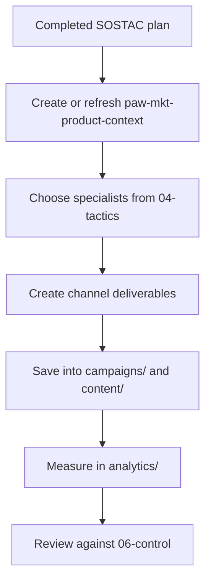

# Workflow: Implementation After SOSTAC

Use this workflow when a brand already has a completed SOSTAC plan and you are ready to execute.

## Goal

Turn the strategy into channel-specific deliverables without losing the context from the plan.

## Typical sequence

1. Load the brand workspace
2. Read the completed SOSTAC plan, especially `04-tactics.md` and `05-action.md`
3. Create or refresh `paw-mkt-product-context.md` (via `/paw-mkt-product-context`)
4. Run the specialist skills that match the tactics
5. Save outputs into the brand workspace
6. Use analytics and control files to measure progress

## Mermaid overview



## Common handoffs

- Content strategy -> SEO, social, email, video
- Launch strategy -> PR, email, social, paid ads, sales
- Retention strategy -> email, analytics, referral
- CRO work -> paid ads, SEO, sales

## What to check before execution

- Is the SOSTAC plan actually complete?
- Does the brand have `paw-mkt-product-context.md`?
- Are the primary channels in `04-tactics.md` clear?
- Does `05-action.md` define owners, timing, and priorities?
- Does `06-control.md` define measurement and triggers?

## Sample prompts

### Basic
```text
/paw-mkt-agency
Our SOSTAC plan is complete. Help me start implementation.
```

### Direct specialist kickoff
```text
/paw-mkt-content
Use the completed SOSTAC plan for LumenOps and create a monthly content calendar plus three high-priority briefs.
```

### Context-first execution
```text
/paw-mkt-product-context
Extract what you can from our completed SOSTAC plan, then fill the remaining gaps so downstream specialists can work from stronger positioning.
```

## Related pages

- [SOSTAC planning](sostac-planning.md)
- [Quick task without a full plan](quick-task-without-full-plan.md)
- [Common patterns](../reference/common-patterns.md)
