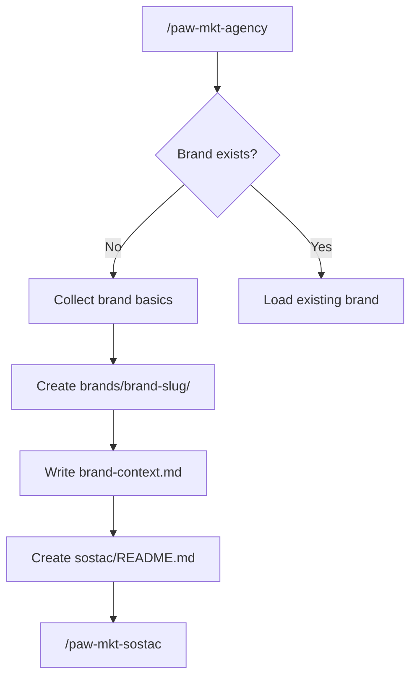

# Workflow: New Brand Onboarding

Use this workflow when you are starting work for a brand that does not yet have a workspace under `.pawbytes/marketing-suites/brands/`.

## Goal

Create the brand workspace, capture the minimum brand context, and route into planning or immediate execution.

## Best starting command

```text
/paw-mkt-agency
```

## What happens

1. The coordinator checks whether a brand already exists.
2. If not, it gathers the basics:
   - brand name
   - what the brand sells
   - target audience
   - current stage
3. It creates the workspace under `.pawbytes/marketing-suites/brands/{brand-slug}/`
4. It writes `brand-context.md`
5. It creates `sostac/README.md`
6. It usually routes next into `/paw-mkt-sostac`

## Files created early in the workflow

```text
.pawbytes/marketing-suites/brands/{brand-slug}/
├── brand-context.md
└── sostac/
    └── README.md
```

## Recommended next step

If the brand does not already have a strategy, continue with `/paw-mkt-sostac`.

## Mermaid overview



## Sample prompts

### Basic
```text
/paw-mkt-agency
I want to start marketing a new SaaS brand.
```

### Context-rich
```text
/paw-mkt-agency
Set up a new brand workspace for Northstar AI. We sell AI call summaries for recruiting teams. Our buyers are heads of talent at 50-500 person companies. We're early-stage and preparing for our first serious outbound push.
```

### Fast setup then planning
```text
/paw-mkt-agency
Create a brand for Acorn Legal. We help small law firms automate intake. Once the workspace is ready, take me into SOSTAC planning.
```

## Related pages

- [Getting started](../getting-started.md)
- [SOSTAC planning](sostac-planning.md)
- [Brand workspace reference](../reference/brand-workspace.md)
