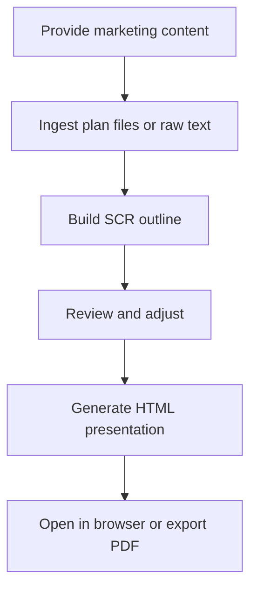

# Presentation Builder

## Overview

Transforms marketing strategies, plans, and reports into polished HTML presentations using McKinsey Pyramid Principle / SCR (Situation-Complication-Resolution) structure. Each presentation has unique visual character — design adapts to your content, audience, and brand.

## When to Use It

- You have a marketing plan and need to present it to stakeholders
- You need to share strategy with executives or clients
- You want a professional deck without spending hours in PowerPoint
- You've completed a SOSTAC analysis and need to communicate findings

## Trigger Phrases

- "Create a presentation from this marketing plan"
- "Build a deck for this strategy"
- "Make a presentation from my SOSTAC plan"
- "Generate a report deck"
- "Turn this strategy into slides"

## Workflow Overview



## Step-by-Step Workflow

| Step | What You Do | What Happens |
|------|-------------|--------------|
| 1 | Provide content | Paste text, share a file path, or reference a paw-mkt-* skill output |
| 2 | Review outline | Presentation Builder creates SCR structure, you approve or edit |
| 3 | Generation | Builder creates HTML with charts, images, and professional styling |
| 4 | Export | Open in browser, present directly, or download as PDF |

## What You Get

| Deliverable | Format | Location |
|-------------|--------|----------|
| HTML Presentation | `.html` (standalone, self-contained) | `.pawbytes/tools-output/presentations/` |
| Charts | Bar, line, pie, scatter (Chart.js) | Embedded in HTML |
| Cover image | Hero image from Pexels or AI-generated | Embedded in HTML |
| PDF download | Via browser print button | One-click from presentation |

## Features

### McKinsey SCR Structure
- **Situation**: Where we are now — current state, context
- **Complication**: The challenge or opportunity — what needs to change
- **Resolution**: The proposed approach — strategy and tactics

### Smart Content Ingestion
- Reads from paw-mkt-* skill outputs
- Accepts file paths to markdown/text documents
- Processes raw text directly

### Professional Visuals
- Brand-aligned styling (if brand config exists)
- Chart.js visualizations for data
- Pexels API stock photos or AI-generated images
- PDF export via browser print

### Headless Mode
Add `--headless` or `-H` to skip interactive review and generate immediately with sensible defaults.

## End-to-End Example

**User**: "Create a presentation from my SOSTAC plan at .pawbytes/marketing-suites/brands/acme/sostac/"

**Presentation Builder**:
1. Reads your SOSTAC plan files
2. Extracts key insights from Situation, Objectives, Strategy, Tactics, Action, Control
3. Creates SCR outline:

```
SITUATION
- Current market position
- Audience analysis findings

COMPLICATION
- Competitive threats identified
- Opportunity gaps

RESOLUTION
- Strategic objectives
- Tactical approach
- Action timeline
- KPI dashboard
```

4. Asks: "Here's the presentation structure. Ready to generate?"

**User**: "Yes, add a slide about budget allocation"

**Presentation Builder**:
- Updates outline
- Generates HTML with:
  - Cover slide with hero image
  - Situation analysis with market share chart
  - Complication with competitive landscape
  - Resolution with strategy overview
  - Tactics breakdown with timeline
  - Budget allocation pie chart
  - KPI dashboard
  - PDF download button

**Output**: `.pawbytes/tools-output/presentations/acme-marketing-strategy.html`

Open in any browser, present directly, or click "Download PDF".

## Image Sources

| Option | What It Does | Requirement |
|--------|--------------|-------------|
| Pexels API | Free stock photos | `pexels_api_key` in config |
| fal.ai | AI-generated custom images | `fal_api_key` in config |
| Placeholder | Professional placeholder | No API needed |

## Chart Types

| Chart | Best For |
|-------|----------|
| Bar chart | Comparisons across categories |
| Line chart | Trends over time |
| Pie/Doughnut | Proportions, market share |
| Scatter plot | Correlations between variables |

## Related Skills

- [paw-mkt-setup](../../marketing/skills/paw-mkt-setup.md) — Brand configuration source
- [paw-mkt-sostac](../../marketing/skills/paw-mkt-sostac.md) — Creates marketing plans that feed into presentations
- [Tools Setup](./paw-tools-setup.md) — Configure API keys for images

## Workflow

See [Presentation from Marketing Plan](../workflows/presentation-from-marketing-plan.md) for a complete end-to-end example starting from SOSTAC analysis.