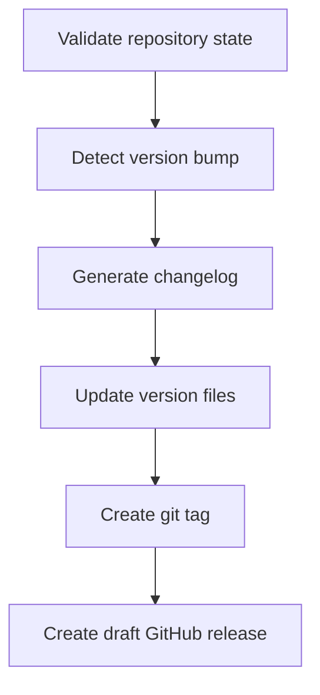

# Release Automation

## Overview

Automates the complete software release workflow: version bumping, changelog generation, git tagging, and GitHub release creation. Ensures clean, traceable releases with informative changelogs derived from your commit history.

## When to Use It

- You're ready to release a new version of your software
- You want consistent, repeatable release processes
- You use conventional commits and want automatic version detection
- You need a changelog but don't want to write it manually

## Trigger Phrases

- "Create a release"
- "Cut a release"
- "Publish a new version"
- "Prepare a release"
- "Release v2.0"

## Prerequisites

| Requirement | How to Check |
|-------------|--------------|
| Git repository | Must have at least one commit |
| GitHub CLI | Run `gh auth status` to verify |
| Clean working tree | No uncommitted changes |
| Conventional commits | Commit messages use `feat:`, `fix:`, `breaking:` |

## Workflow Overview



## Step-by-Step Workflow

| Step | What Happens | Your Role |
|------|--------------|-----------|
| 1 | Validate | Checks prerequisites, warns if issues |
| 2 | Version detection | Analyzes commits, suggests version bump |
| 3 | Changelog generation | Creates changelog from commit messages |
| 4 | Release | Updates files, creates tag, pushes, creates GitHub draft |

### Version Bump Logic

| Commit Type | Version Change | Example |
|-------------|----------------|---------|
| `breaking:` | Major | 1.0.0 → 2.0.0 |
| `feat:` | Minor | 1.0.0 → 1.1.0 |
| `fix:` / others | Patch | 1.0.0 → 1.0.1 |

## What You Get

| Artifact | Location |
|----------|----------|
| Updated version files | Project root (package.json, Cargo.toml, etc.) |
| Changelog entry | `{project-root}/CHANGELOG.md` |
| Git tag | Pushed to origin |
| GitHub release | Draft, ready to publish |
| Release report | `.pawbytes/tools-output/releases/` |

## Command Options

| Option | What It Does |
|--------|--------------|
| `--headless` or `-H` | Non-interactive execution with sensible defaults |
| `--version 1.2.3` | Specify version explicitly |
| `--branch main` | Set allowed release branch |
| `--pre-release beta` | Create pre-release (beta/rc/alpha) |

## End-to-End Example

**User**: "Create a release"

**Release Automation**:
```
Checking repository...
✓ Working tree is clean
✓ GitHub CLI authenticated
✓ On branch: main

Found commits since v1.2.0:
- feat: add dark mode support
- feat: add user preferences panel
- fix: resolve login timeout issue
- fix: correct pagination on dashboard

Recommended version: v1.3.0 (minor bump for 2 features)

Changelog preview:
## [1.3.0] - 2026-04-02
### Features
- Add dark mode support
- Add user preferences panel

### Bug Fixes
- Resolve login timeout issue
- Correct pagination on dashboard

Proceed with release?
```

**User**: "Yes"

**Release Automation**:
1. Updates package.json: `1.2.0` → `1.3.0`
2. Prepends changelog entry to CHANGELOG.md
3. Creates git tag `v1.3.0`
4. Pushes tag to origin
5. Creates draft GitHub release with changelog

**Output**:
```text
Release v1.3.0 created!

Review and publish it from your repository's Releases page in GitHub.
```

## First Release Handling

If no previous tags exist, the changelog includes all commits since repository start. This gives you a complete history for your first release.

## Headless Mode

For CI/CD pipelines or automated releases:

```bash
# Automatic version detection
"Create a release --headless"

# Specific version
"Create a release --headless --version 2.0.0"

# Pre-release
"Create a release --headless --pre-release beta"
```

## Supported Version Files

The automation detects and updates version numbers in:

- `package.json` (Node.js)
- `Cargo.toml` (Rust)
- `pyproject.toml` (Python)
- `VERSION` file
- And others...

## Related Skills

- [Tools Setup](./paw-tools-setup.md) — Configure release defaults
- [paw-mkt-dashboard](../../marketing/skills/paw-mkt-dashboard.md) — Create release announcement dashboards