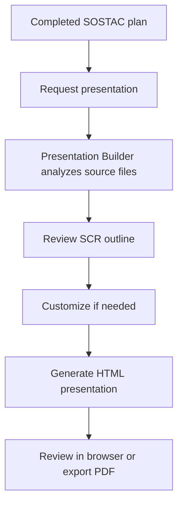

# Presentation from Marketing Plan

## Overview

End-to-end workflow showing how to create a professional presentation from a SOSTAC marketing plan. This workflow combines Marketing Suite and Tools Suite skills.

**Time required**: 10-15 minutes

## Scenario

You've completed a SOSTAC marketing strategy and need to present it to your executive team. You want a polished deck that tells the story clearly without spending hours in presentation software.

## Prerequisites

- A completed SOSTAC marketing plan (from `paw-mkt-sostac`)
- (Optional) Brand configuration (from `paw-mkt-setup`)
- (Optional) API keys for custom images (configured via `paw-tools-setup`)

## Workflow Overview



## Workflow Steps

### Step 1: Complete Your Marketing Plan

Start with a SOSTAC analysis. If you haven't done this yet:

**You**: "Create a SOSTAC marketing plan for my new product launch"

**SOSTAC Skill**: Guides you through:
- Situation analysis
- Objectives setting
- Strategy development
- Tactics planning
- Action timeline
- Control/KPIs

**Output**: Complete marketing plan in `.pawbytes/marketing-suites/brands/{brand-slug}/sostac/`

**Time**: 20-30 minutes

---

### Step 2: Request Presentation

Once your plan is complete, request the presentation.

**You**: "Create a presentation from my SOSTAC plan"

Alternatively, specify the plan location:

**You**: "Build a deck from .pawbytes/marketing-suites/brands/mybrand/sostac/plan-summary.md"

---

### Step 3: Review the Outline

Presentation Builder analyzes your plan and creates an SCR (Situation-Complication-Resolution) outline.

**Presentation Builder**:
```
Analyzing marketing plan...

Found SOSTAC components:
- Situation: Market analysis, competitor landscape
- Objectives: 3 SMART goals defined
- Strategy: Positioning and targeting approach
- Tactics: 5-channel marketing mix
- Action: 12-week implementation timeline
- Control: KPIs and measurement framework

Proposed presentation structure:

1. COVER SLIDE
   - Title: "Product Launch Marketing Strategy"
   - Subtitle: Q2 2026

2. SITUATION
   - Current market position
   - Target audience insights
   - Competitive landscape

3. COMPLICATION
   - Market opportunity
   - Key challenges to address

4. RESOLUTION
   - Strategic objectives (3 goals)
   - Core strategy overview
   - Marketing mix by channel
   - 12-week action plan
   - KPI dashboard

Ready to generate? (You can request changes: "Add a slide about budget")
```

---

### Step 4: Customize (Optional)

Request changes before generation.

**You**: "Add a budget breakdown slide after the marketing mix"

**Presentation Builder**: Updates outline to include:
```
5. BUDGET ALLOCATION
   - Channel investment breakdown
   - Pie chart visualization
```

---

### Step 5: Generation

Approve the outline and let Presentation Builder create your deck.

**You**: "Looks good, generate it"

**Presentation Builder**:
```
Generating presentation...

- Creating cover slide with hero image
- Building situation analysis with market data charts
- Generating competitive landscape visualization
- Creating objectives slide with progress indicators
- Building strategy overview
- Creating channel mix bar chart
- Generating budget allocation pie chart
- Building 12-week timeline
- Creating KPI dashboard with metrics

Presentation complete!
```

---

### Step 6: Review and Present

**Output**: `.pawbytes/tools-output/presentations/product-launch-strategy.html`

Open the file in any browser. You can:
- Navigate slides with arrow keys or click
- Present directly from the browser
- Click "Download PDF" for a printable version

---

## Complete Example Dialogue

**User**: "I completed my SOSTAC plan last week for the mobile app launch. Now I need to present it to the board on Friday. Can you create a presentation?"

**Presentation Builder**: "I'll create your presentation from the SOSTAC plan. Let me find it...

Found: `.pawbytes/marketing-suites/brands/mobile-app-launch/sostac/`

Here's the proposed structure:

**SITUATION**
- Current market: 2M mobile users in target demographic
- Key insight: 73% prefer video content
- Competition: 3 main competitors, none with our AI features

**COMPLICATION**
- Opportunity: $50M addressable market growing 15% YoY
- Challenge: Low brand awareness (12% aided recall)

**RESOLUTION**
- Objective: 100K downloads in Q2
- Strategy: Position as "AI-powered fitness that adapts to you"
- Tactics: TikTok creator partnerships, influencer campaign, app store optimization
- Timeline: 12-week phased rollout
- Budget: $150K allocation

Would you like me to add or change anything before generating?"

**User**: "Add a slide about our competitive advantages, and make sure the budget breakdown is included"

**Presentation Builder**: "Got it. Updated structure:

[Updated outline showing competitive advantages and budget breakdown]

Generating now..."

**Output**: `mobile-app-launch-strategy.html` — Ready for Friday's board meeting

---

## Output File Structure

```
.pawbytes/tools-output/presentations/
└── mobile-app-launch-strategy.html
    ├── Cover slide with hero image
    ├── Situation analysis (3 slides)
    ├── Complication (2 slides)
    ├── Resolution (5 slides)
    ├── Budget breakdown (1 slide with pie chart)
    ├── Timeline (1 slide with Gantt-style visualization)
    ├── KPI dashboard (1 slide with metrics)
    └── PDF download button
```

---

## Tips for Best Results

1. **Complete SOSTAC first** — A thorough marketing plan leads to a better presentation
2. **Include data** — Numbers and metrics become compelling charts automatically
3. **Be specific in customization** — "Add a slide comparing us to Competitor X" works better than "make it better"
4. **Review in browser** — Navigate through all slides before presenting to catch any issues
5. **Download PDF backup** — Always have a PDF version ready for sharing or technical issues

---

## Related Workflows

- [SOSTAC Marketing Planning](../../marketing/workflows/sostac-planning.md) — Create the marketing plan that feeds into this workflow
- [Campaign Execution](../../creative/workflows/campaign-execution.md) — Execute the tactics from your presentation