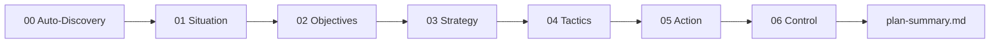

# Workflow: SOSTAC Planning

Use this workflow when you want a full strategy before running channel execution.

## Best starting command

```text
/paw-mkt-sostac
```

You can also start with `/paw-mkt-agency`, which will route you here when planning is missing.

## What SOSTAC creates

The planning workflow builds a complete strategy in six phases:

1. Situation
2. Objectives
3. Strategy
4. Tactics
5. Action
6. Control

Before Phase 1, it also runs **Auto-Discovery** research.

## Output files

```text
brands/{brand-slug}/sostac/
├── README.md
├── 00-auto-discovery.md
├── 01-situation.md
├── 02-objectives.md
├── 03-strategy.md
├── 04-tactics.md
├── 05-action.md
├── 06-control.md
└── plan-summary.md
```

## How the interaction works

- The skill reads existing brand files first
- It resumes from the first incomplete phase
- It asks questions in batches, not all at once
- It drafts each phase for confirmation before saving
- It uses earlier phases to shape later ones

## When to use it

Use SOSTAC when:
- you are starting serious marketing from scratch
- tactics feel disconnected
- multiple specialists will need a shared strategy
- you want a plan that can survive across sessions

## Mermaid overview



## What to prepare

Bring as much of this as you can:
- website and pricing page
- product description
- audience and segments
- current results or baselines
- competitors
- known channel history
- budget and team constraints

## After planning

A complete plan usually leads into:
- `/paw-mkt-product-context`
- `/paw-mkt-content`
- `/paw-mkt-seo`
- `/paw-mkt-email`
- `/paw-mkt-social`
- `/paw-mkt-paid-ads`
- `/paw-mkt-analytics`

## Sample prompts

### Basic
```text
/paw-mkt-sostac
Let's build a marketing plan for our brand.
```

### Resume an in-progress plan
```text
/paw-mkt-sostac
Continue the SOSTAC plan for BrightLedger from the next incomplete phase.
```

### Strategy-first prompt
```text
/paw-mkt-sostac
We're scaling a B2B workflow tool and need a full 6-phase marketing plan before we invest further in content, paid ads, and lifecycle email.
```

## Related pages

- [Implementation after SOSTAC](implementation-after-sostac.md)
- [Product marketing context](../skills/paw-mkt-product-context.md)
- [Deliverables and file locations](../reference/deliverables-and-file-locations.md)
